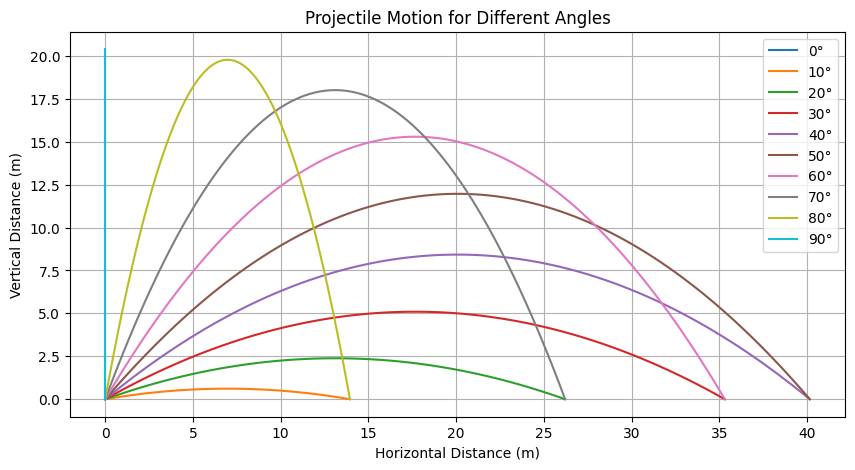
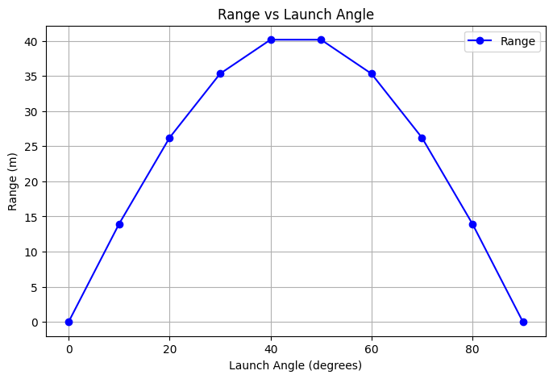
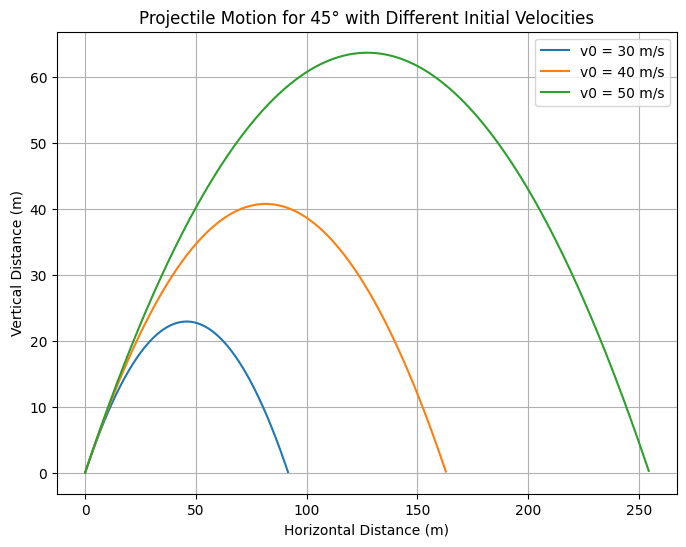
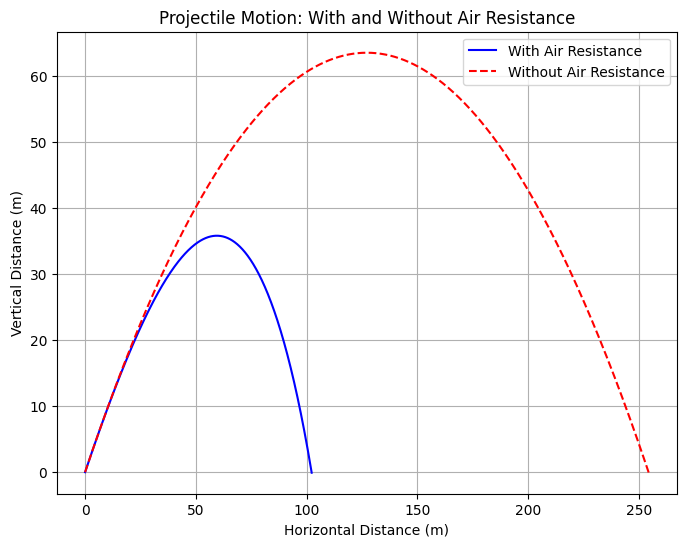

**Theoretical Foundation of Projectile Motion**


### Derivation of Governing Equations

Projectile motion can be described by decomposing the motion into horizontal and vertical components. The motion follows Newton’s second law of motion:


$$F = ma$$

For a projectile launched with an initial velocity $v_0$ at an angle $\theta$, the velocity components are:


 $$ v_{0x} = v_0 \cos\theta $$ 
 $$ v_{0y} = v_0 \sin\theta $$


Assuming constant gravitational acceleration $g$ acting downward, the equations of motion arise from Newton’s second law:

#### Horizontal Motion:
Since there is no acceleration in the horizontal direction (neglecting air resistance), the equation of motion simplifies to:

$$\frac{d^2x}{dt^2} = 0$$

Integrating twice gives:

$$x(t) = v_0 \cos\theta \cdot t$$

#### Vertical Motion:
The vertical motion follows:

$$\frac{d^2y}{dt^2} = -g$$

Integrating once:

$$\frac{dy}{dt} = v_0 \sin\theta - g t$$

Integrating again:

$$y(t) = v_0 \sin\theta \cdot t - \frac{1}{2} g t^2$$

### Time of Flight
To determine the total time the projectile remains in the air, we set $y = 0$ (assuming launch and landing at the same height):

$$0 = v_0 \sin\theta \cdot t - \frac{1}{2} g t^2$$

Solving for $t$:

$$t = \frac{2 v_0 \sin\theta}{g}$$

### Range of the Projectile
The horizontal range $R$ is found by substituting the time of flight into the horizontal motion equation:

$$R = v_{0x} t$$

$$R = (v_0 \cos\theta) \times \frac{2 v_0 \sin\theta}{g}$$

Using the identity $2 \sin\theta \cos\theta = \sin 2\theta$:

$$R = \frac{v_0^2 \sin 2\theta}{g}$$

### Effect of Launch Angle on Range
The range equation shows that $R$ depends on $\sin 2\theta$. The maximum range occurs when $\sin 2\theta = 1$, which happens at $2\theta = 90^\circ$ or $\theta = 45^\circ$. Therefore, the optimal launch angle for maximum range is **45 degrees**.

### Influence of Initial Conditions
Several factors influence the projectile’s trajectory:

1. **Initial Velocity $v_0$**: Higher speeds result in a longer range.
2. **Gravitational Acceleration $g$**: Increased gravity shortens the range.
3. **Launch Angle $\theta$**: Different angles yield different parabolic trajectories, with 45° providing maximum range.
4. **Launch Height**: If the projectile starts from a height $h$, the time of flight increases, thereby affecting the range.

---

**Investigation of Horizontal Range Dependence**

### Dependence on Angle of Projection
From the range equation:

$$R = \frac{v_0^2 \sin 2\theta}{g}$$

- The function $\sin 2\theta$ dictates how $R$ varies with angle.
- $R$ increases as $\theta$ moves from 0° to 45° and decreases thereafter up to 90°.
- This symmetric behavior results in the same range for complementary angles (e.g., 30° and 60°).

### Effect of Other Parameters
- **Initial Velocity ($v_0$)**: Since range is proportional to $v_0^2$, doubling the velocity quadruples the range.
- **Gravitational Acceleration ($g$)**: Range is inversely proportional to $g$, meaning that stronger gravity (such as on Jupiter) reduces range, while weaker gravity (such as on the Moon) increases range.
- **Launch Height ($h$)**: An increased launch height extends the flight time, thereby increasing the range.

---

**Family of Solutions**

By varying initial conditions, a family of parabolic trajectories emerges:
- **Different launch angles** create different paths, with the same range for complementary angles.
- **Different initial velocities** scale the trajectory while maintaining its shape.
- **Different gravitational accelerations** alter both the height and range.
- **Different launch heights** modify the total flight time and final landing position.

---

**Practical Applications**

Projectile motion applies to numerous real-world scenarios, where additional factors such as air resistance and uneven terrain must be considered. Some key applications include:

- **Ballistics**: Predicting the trajectory of bullets, missiles, and artillery shells requires accounting for air drag and wind resistance.
- **Sports Science**: Understanding projectile motion helps optimize techniques in sports like soccer, basketball, and golf.
- **Engineering and Construction**: Calculating the paths of thrown objects or designing safe trajectories for cranes and demolition projects.
- **Space Exploration**: Modeling the launch and re-entry paths of rockets and satellites, where varying gravitational fields must be factored in.
- **Environmental Studies**: Studying volcanic eruptions, landslides, and debris flows to predict impact zones and mitigate damage.

In these cases, computational models incorporating additional forces, such as drag and lift, refine the accuracy of projectile predictions.

---

## Implementation##

### Computational Simulation of Projectile Motion
Developing a computational tool allows for precise analysis of projectile motion under varying conditions. A basic algorithm for simulating projectile motion follows these steps:

1. **Initialize Parameters**: Define initial velocity $v_0$, launch angle $\theta$, gravitational acceleration $g$, and time step $\Delta t$.
2. **Calculate Components**: Compute horizontal and vertical velocity components.
3. **Iterate Motion**: Update position and velocity using kinematic equations at small time steps.
4. **Plot Trajectory**: Visualize the projectile’s path using computational tools such as Python (Matplotlib) or MATLAB.
5. **Analyze Variations**: Generate plots of range as a function of launch angle for different velocities and gravitational conditions.

Such simulations help in educational demonstrations, research, and engineering applications where precise trajectory predictions are required.


---

### **Implementation 1**  

#### **Computational Simulation of Projectile Motion**  

To analyze projectile motion computationally, we implement a numerical simulation. The following Python script:  
✅ Simulates the motion of a projectile for different launch angles.  
✅ Plots the **trajectory** of the projectile.  
✅ Visualizes **range vs launch angle** to analyze how the angle affects the range.  

#### **Python Code for Simulation**  

```python
import numpy as np
import matplotlib.pyplot as plt

# Constants
g = 9.81  # Gravitational acceleration (m/s^2)
v0 = 20  # Initial velocity (m/s)
angles = np.linspace(0, 90, 10)  # Angles from 0° to 90°

# Function to compute projectile trajectory
def projectile_trajectory(v0, theta, g):
    theta_rad = np.radians(theta)  # Convert to radians
    vx = v0 * np.cos(theta_rad)
    vy = v0 * np.sin(theta_rad)
    
    # Time of flight
    t_flight = 2 * vy / g
    t = np.linspace(0, t_flight, num=100)

    # Compute x and y coordinates
    x = vx * t
    y = vy * t - 0.5 * g * t**2
    return x, y

# Plot projectile trajectories for different angles
plt.figure(figsize=(10, 5))
for angle in angles:
    x, y = projectile_trajectory(v0, angle, g)
    plt.plot(x, y, label=f'{int(angle)}°')

plt.xlabel("Horizontal Distance (m)")
plt.ylabel("Vertical Distance (m)")
plt.title("Projectile Motion for Different Angles")
plt.legend()
plt.grid(True)
plt.show()

# Compute and plot range vs angle
ranges = [(v0**2 * np.sin(2 * np.radians(angle))) / g for angle in angles]

plt.figure(figsize=(8, 5))
plt.plot(angles, ranges, 'bo-', label="Range")
plt.xlabel("Launch Angle (degrees)")
plt.ylabel("Range (m)")
plt.title("Range vs Launch Angle")
plt.legend()
plt.grid(True)
plt.show()
```





#### **Interpretation of Results**  

1. **Projectile Trajectories for Different Angles**  
   - The first plot shows how the **path of the projectile** changes with the launch angle.  
   - Lower angles result in longer but lower trajectories, while higher angles make the projectile reach greater heights but shorter distances.  
   - The optimal trajectory for maximum range appears near **45°**, confirming the theoretical prediction.  

2. **Range vs Launch Angle Graph**  
   - The second plot demonstrates the **relationship between range and launch angle**.  
   - The **range is maximum at 45°** and symmetric for complementary angles (e.g., **30° and 60° yield the same range**).  
   - This confirms that the **optimal launch angle for maximum horizontal distance in ideal conditions is 45°**.  

#### **Limitations & Real-World Considerations**  
- This model **neglects air resistance**, which in reality **reduces range**.  
- Uneven terrain or variable gravity (e.g., Moon vs Earth) can alter the motion.  
- **Wind and drag forces** significantly affect projectiles in sports and ballistics.  
- More **advanced simulations** incorporate fluid dynamics for real-world accuracy.  

---


 

---

### **Implementation 2: Simulating Projectile Motion**  

To visualize how projectile motion changes with different initial velocities, we implemented a Python script that simulates the motion of a projectile launched at **45°** with three different speeds: **30, 40, and 50 m/s**.  

#### **Key Observations:**  
- Higher initial velocity results in a **longer range** and **greater peak height** while maintaining the same parabolic trajectory shape.  
- The motion follows the equations derived earlier, confirming that the **range is proportional to the square of velocity**.  
- The graph clearly demonstrates how projectiles with different speeds travel varying distances while following a predictable arc.  

This computational model allows for further analysis, such as exploring different angles, gravitational effects, and real-world factors like air resistance.  

```python

import numpy as np
import matplotlib.pyplot as plt

def plot_projectile(v0_values, theta=45, g=9.81, dt=0.01):
    plt.figure(figsize=(8, 6))

    for v0 in v0_values:
        theta_rad = np.radians(theta)
        vx = v0 * np.cos(theta_rad)
        vy = v0 * np.sin(theta_rad)

        t_max = 2 * vy / g  # Total flight time
        t = np.arange(0, t_max, dt)

        x = vx * t
        y = vy * t - 0.5 * g * t**2

        plt.plot(x, y, label=f"v0 = {v0} m/s")

    plt.xlabel("Horizontal Distance (m)")
    plt.ylabel("Vertical Distance (m)")
    plt.title(f"Projectile Motion for {theta}° with Different Initial Velocities")
    plt.legend()
    plt.grid()
    plt.show()

# Run simulation for initial velocities 30, 40, and 50 m/s
plot_projectile([30, 40, 50])
```




Here's how you can incorporate this code and explanation into your presentation:

---

### ** Implementation 3: Comparison of Projectile Motion: With and Without Air Resistance **

The following plot compares projectile motion with and without air resistance. The simulation uses a launch angle of 45° and an initial velocity of 50 m/s.

#### **Python Code to Simulate Projectile Motion with and Without Air Resistance:**

```python
import numpy as np
import matplotlib.pyplot as plt

def projectile_motion_with_air_resistance(v0, angle, g=9.81, dt=0.01, air_resistance=True):
    # Constants
    mass = 1.0  # Mass of the projectile in kg (assumed)
    drag_coefficient = 0.47  # Drag coefficient for a sphere (approx)
    radius = 0.1  # Radius of the projectile (in meters)
    area = np.pi * radius**2  # Cross-sectional area (m^2)
    air_density = 1.225  # Air density at sea level (kg/m^3)
    
    # Initial conditions
    theta_rad = np.radians(angle)
    vx = v0 * np.cos(theta_rad)
    vy = v0 * np.sin(theta_rad)
    
    # Initial position
    x, y = 0, 0
    
    # Lists to store the position data
    x_vals, y_vals = [x], [y]
    
    # Air resistance calculations
    if air_resistance:
        drag_force = lambda v: 0.5 * air_density * area * drag_coefficient * v**2
    else:
        drag_force = lambda v: 0  # No drag force
    
    # Time of flight estimation
    while y >= 0:
        speed = np.sqrt(vx**2 + vy**2)
        
        # Calculate drag force if air resistance is considered
        drag_x = drag_force(speed) * (vx / speed) if air_resistance else 0
        drag_y = drag_force(speed) * (vy / speed) if air_resistance else 0
        
        # Accelerations
        ax = -drag_x / mass
        ay = -g - drag_y / mass
        
        # Update velocities
        vx += ax * dt
        vy += ay * dt
        
        # Update positions
        x += vx * dt
        y += vy * dt
        
        # Store positions
        x_vals.append(x)
        y_vals.append(y)
    
    return x_vals, y_vals

# Parameters
v0 = 50  # Initial velocity (m/s)
angle = 45  # Launch angle (degrees)

# Plot projectile motion with and without air resistance
plt.figure(figsize=(8, 6))

# Plot with air resistance
x_vals_with_air, y_vals_with_air = projectile_motion_with_air_resistance(v0, angle, air_resistance=True)
plt.plot(x_vals_with_air, y_vals_with_air, label="With Air Resistance", color='blue')

# Plot without air resistance
x_vals_without_air, y_vals_without_air = projectile_motion_with_air_resistance(v0, angle, air_resistance=False)
plt.plot(x_vals_without_air, y_vals_without_air, label="Without Air Resistance", color='red', linestyle='--')

# Adding labels and title
plt.xlabel("Horizontal Distance (m)")
plt.ylabel("Vertical Distance (m)")
plt.title("Projectile Motion: With and Without Air Resistance")
plt.legend()
plt.grid(True)
plt.show()
```

---




#### **Explanation of the Plot:**

- **Blue Line:** Represents the projectile trajectory when **air resistance** is taken into account. Notice how the range is shorter and the maximum height is reduced compared to the ideal case.
- **Red Dashed Line:** Represents the idealized trajectory assuming **no air resistance**. This is the parabolic motion we commonly study in basic physics.

#### **Key Insights:**
- **Air Resistance:** In real-world scenarios, air resistance causes the projectile to decelerate more quickly, reducing both its range and maximum height.
- **Idealized Model:** The absence of air resistance results in a larger range and higher trajectory, which is what we see in an idealized situation without drag forces.

---


**Conclusion:**

Projectile motion is a foundational concept in physics, with applications spanning from sports to engineering and space exploration. While the idealized model of projectile motion provides a clear understanding of the relationship between launch angle, initial velocity, and range, real-world factors like air resistance and varying terrain complicate these trajectories. Computational models, such as the one presented here, allow for more accurate predictions by incorporating these additional forces, thus enhancing our ability to model and optimize projectile motion in practical scenarios.