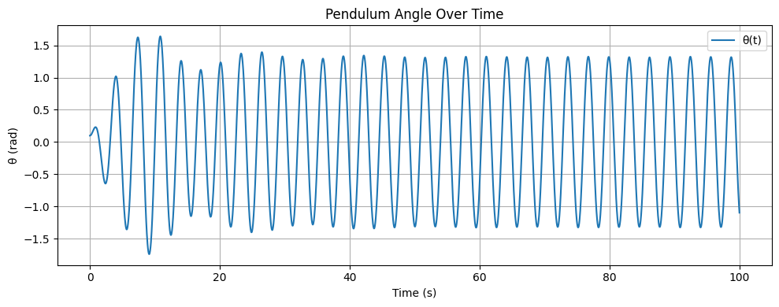
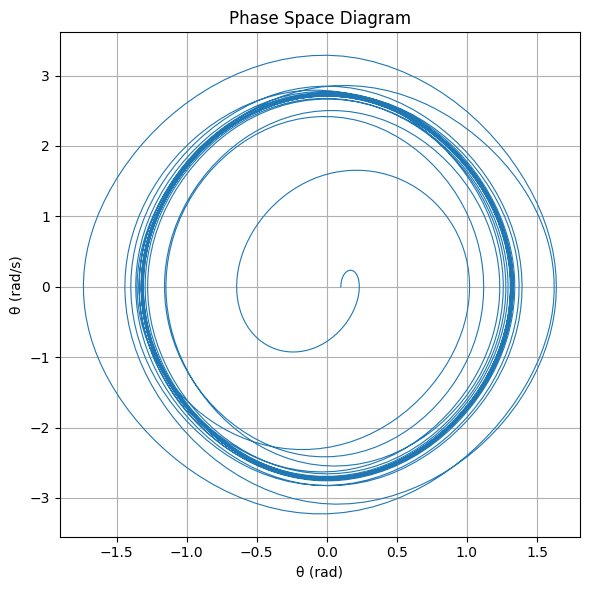
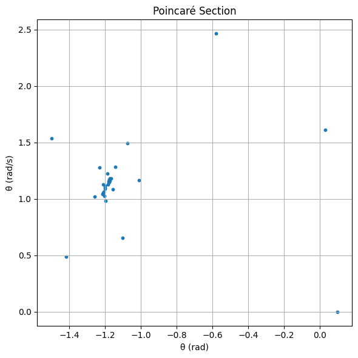

---

# 🎢 **Investigating the Dynamics of a Forced Damped Pendulum**

---

## 🎯 **Motivation**

The **forced damped pendulum** is not just another mechanical system—  
it's a **gateway into the world of complex, nonlinear dynamics**.

When damping and a periodic driving force are both present, something magical happens:  
a simple swing turns into a playground of **resonance, chaos, and quasiperiodicity**.

This makes the system a powerful **analogy** for real-world phenomena like:

- Climate cycles 🌍  
- Vibrating bridges 🌉  
- Electrical circuits ⚡  

So why study this? Because understanding how **a simple pendulum** behaves under stress tells us **how complex systems thrive—or fail**—in the face of repeated forces.

---

## 🧠 **1. Theoretical Foundation**

Let’s start from the fundamental equation that governs the motion:

$$
\frac{d^2\theta}{dt^2} + \gamma \frac{d\theta}{dt} + \omega_0^2 \sin(\theta) = A \cos(\omega t)
$$

Where:
- $\theta(t)$: Angular displacement  
- $\gamma$: Damping coefficient  
- $\omega_0$: Natural frequency  
- $A$: Driving force amplitude  
- $\omega$: Driving frequency  

---

### ✏️ **Small-Angle Approximation**  

When the angle is small $(\theta \ll 1)$, we simplify:

$$
\sin(\theta) \approx \theta
$$

Which gives:

$$
\frac{d^2\theta}{dt^2} + \gamma \frac{d\theta}{dt} + \omega_0^2 \theta = A \cos(\omega t)
$$

This version is linear and lets us dig into analytical solutions.

---

### 🔍 **General Solution**

The full solution is the sum of:

1. **Homogeneous (transient) part**  
2. **Particular (steady-state) part**

**Transient part:**

$$
\theta_{\text{hom}}(t) = e^{-\frac{\gamma}{2} t} \left( C_1 \cos(\Omega t) + C_2 \sin(\Omega t) \right)
$$

Where:

$$
\Omega = \sqrt{\omega_0^2 - \left(\frac{\gamma}{2}\right)^2}
$$

**Steady-state part:**

$$
\theta_{\text{part}}(t) = B \cos(\omega t - \delta)
$$

Amplitude and phase shift are:

$$
B = \frac{A}{\sqrt{(\omega_0^2 - \omega^2)^2 + (\gamma \omega)^2}}, \quad \tan(\delta) = \frac{\gamma \omega}{\omega_0^2 - \omega^2}
$$

---

### 📈 **Resonance: The Sweet Spot of Energy**

Resonance happens when the system **absorbs maximum energy** from the driving force:

$$
\omega_{\text{res}} = \sqrt{\omega_0^2 - \frac{\gamma^2}{2}}
$$

Here, even small forces can cause **large-amplitude** oscillations.  
This is where beauty meets danger in mechanical systems!

---

## 🌀 **2. Analysis of Dynamics**

### 🎛️ Parameter Effects

Let’s see how changing different parameters affects motion:

- **Damping ($\gamma$)**:  
  - High → suppresses motion  
  - Low → enables oscillation and even chaos

- **Driving amplitude ($A$)**:  
  - Low → simple periodic motion  
  - High → system may go chaotic

- **Driving frequency ($\omega$)**:  
  - Near $\omega_0$ → **resonance!**  
  - Far → low amplitude

---

### ⚠️ From Order to Chaos

As you tweak $A$ or $\omega$, the system transitions like this:

1. **Simple periodic motion**  
2. **Quasiperiodic motion**  
3. **Period-doubling**  
4. **Chaos** 🚨

Visualize this with:
- **Phase space plots** $(\theta \text{ vs } \dot{\theta})$
- **Poincaré sections**: snapshot once per cycle
- **Bifurcation diagrams**: to see chaos emerge!

---

## ⚙️ **3. Real-World Applications**

This isn't just theory—it shows up in real life:

- 🧲 **Energy Harvesting**:  
  Tiny vibrations → electricity (like in wearables or smart bridges)

- 🌉 **Suspension Bridges**:  
  Unchecked resonance can cause catastrophic failure  
  (hello, Tacoma Narrows Bridge...)

- ⚡ **Oscillating Circuits**:  
  The pendulum’s math is mirrored in RLC circuits with AC driving.

---

## 🚀 Wrap-Up

The forced damped pendulum is more than a swinging weight—  
it's a **model for complexity, transition, and control**.

Whether you're an engineer, physicist, or just someone who likes watching the world wiggle into chaos—this system's got something for you.


---

## 🔧 4. Implementation: Computational Model of the Forced Damped Pendulum

We now implement a simulation of the forced damped pendulum to explore its dynamic behavior under varying conditions.

---

### 🔢 4.1 Define the Pendulum Equation

```python
import numpy as np

def forced_damped_pendulum(t, y, gamma, omega0, A, omega_drive):
    theta, theta_dot = y
    dtheta_dt = theta_dot
    dtheta_dot_dt = -gamma * theta_dot - omega0**2 * np.sin(theta) + A * np.cos(omega_drive * t)
    return [dtheta_dt, dtheta_dot_dt]
```
**Explanation:** This function defines the equations of motion for the forced damped pendulum. The pendulum's behavior is modeled using two ordinary differential equations (ODEs):
- `dθ/dt = θ̇`, where `θ` is the angle and `θ̇` is the angular velocity.
- `dθ̇/dt = -γ * θ̇ - ω₀² * sin(θ) + A * cos(ω_drive * t)`, which represents the forces acting on the pendulum, including damping (`-γ * θ̇`), restoring force (`-ω₀² * sin(θ)`), and the external periodic driving force (`A * cos(ω_drive * t)`).

This equation is the foundation of the simulation, capturing both the damping and the external driving force acting on the system.

---

### 🧪 4.2 Simulate the Pendulum's Motion

```python
from scipy.integrate import solve_ivp
import matplotlib.pyplot as plt

# Parameters
gamma = 0.2
omega0 = 2.0
A = 1.2
omega_drive = 2.0

# Initial conditions
y0 = [0.1, 0.0]
t_eval = np.linspace(0, 100, 3000)

# Solve the system
sol = solve_ivp(
    forced_damped_pendulum,
    (0, 100),
    y0,
    t_eval=t_eval,
    args=(gamma, omega0, A, omega_drive)
)
```
**Explanation:** This code solves the system of differential equations defined in **4.1**. We use the `solve_ivp` (solve initial value problem) function from the `scipy.integrate` module to numerically solve the equations. The parameters such as damping coefficient (`γ`), natural frequency (`ω₀`), amplitude of the driving force (`A`), and the frequency of the driving force (`ω_drive`) are defined here.

The initial conditions for the angle and angular velocity (`y0 = [0.1, 0.0]`) are set, and the solution is computed over a time span of 0 to 100 seconds with 3000 time steps (`t_eval`). The result is stored in the variable `sol`, which contains both the time (`sol.t`) and the pendulum's angle and angular velocity at each time step (`sol.y`).

This step prepares the data for later visualization and analysis.


---

### 📈 4.3 Plot θ(t) – Time Series

```python
plt.figure(figsize=(10, 4))
plt.plot(sol.t, sol.y[0], label='θ(t)')
plt.xlabel('Time (s)')
plt.ylabel('θ (rad)')
plt.title('Pendulum Angle Over Time')
plt.grid(True)
plt.legend()
plt.tight_layout()
plt.show()
```

 

**Explanation:** This graph shows the angle of the forced damped pendulum over time, represented by the function `θ(t)`. It reveals how the pendulum's angle evolves over time, providing insights into whether the system reaches a stable equilibrium or exhibits periodic motion. The graph allows you to understand the time dynamics of the pendulum.

---

### 🌀 4.4 Phase Space Diagram (θ vs θ̇)

```python
plt.figure(figsize=(6, 6))
plt.plot(sol.y[0], sol.y[1], lw=0.8)
plt.xlabel('θ (rad)')
plt.ylabel('θ̇ (rad/s)')
plt.title('Phase Space Diagram')
plt.grid(True)
plt.tight_layout()
plt.show()
```

 

**Explanation:** This graph illustrates the phase space of the pendulum, plotting the angle (`θ`) against the angular velocity (`θ̇`). The horizontal axis represents the angle, while the vertical axis represents angular velocity. This diagram helps you visualize the pendulum's motion in its state space, showing whether the system behaves in a periodic or chaotic manner.

---

### 🔁 4.5 Poincaré Section

```python
T_drive = 2 * np.pi / omega_drive
poincare_t = np.arange(0, 100, T_drive)

poincare_points = []
for pt in poincare_t:
    idx = (np.abs(sol.t - pt)).argmin()
    poincare_points.append((sol.y[0][idx], sol.y[1][idx]))

x_vals, y_vals = zip(*poincare_points)

plt.figure(figsize=(6, 6))
plt.scatter(x_vals, y_vals, s=10)
plt.xlabel('θ (rad)')
plt.ylabel('θ̇ (rad/s)')
plt.title('Poincaré Section')
plt.grid(True)
plt.tight_layout()
plt.show()
```

 

**Explanation:** The Poincaré section is a tool for analyzing the dynamics of the system by recording points in phase space at regular intervals of the driving period. In this case, the graph plots the points in the `(θ, θ̇)` plane that correspond to times at multiples of the driving period. This visualization is useful for identifying periodic behavior or chaotic patterns in the system.

---


