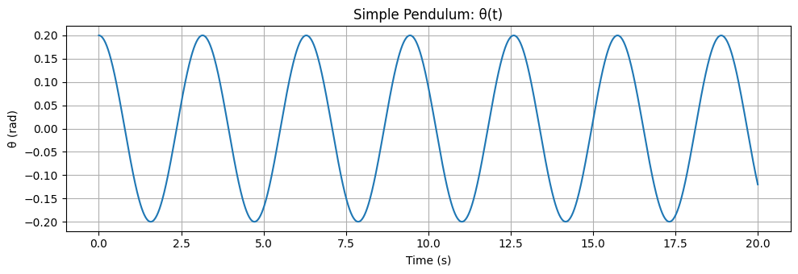
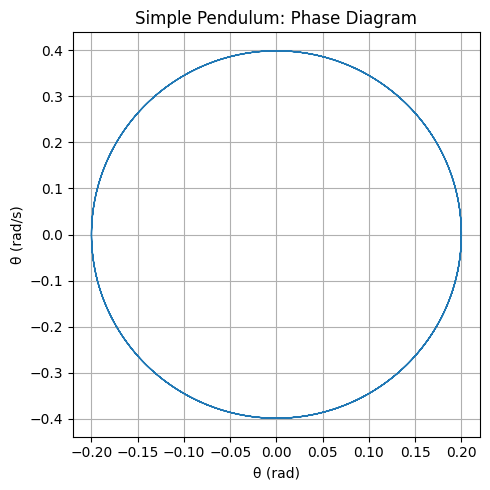
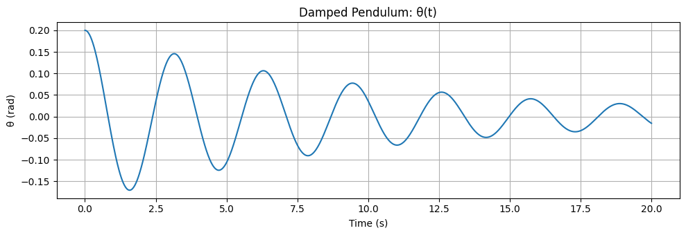
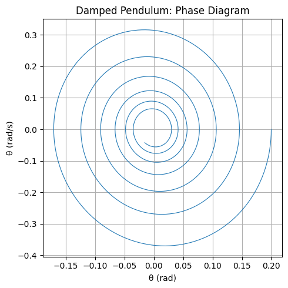
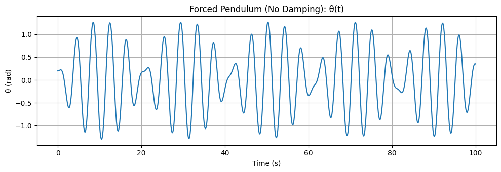
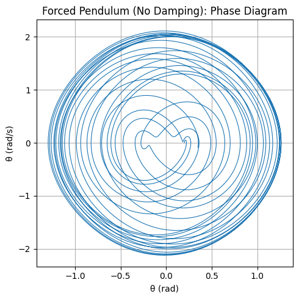
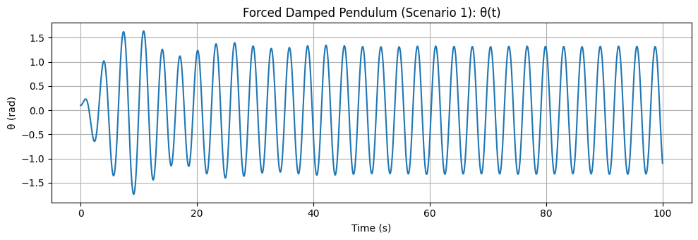
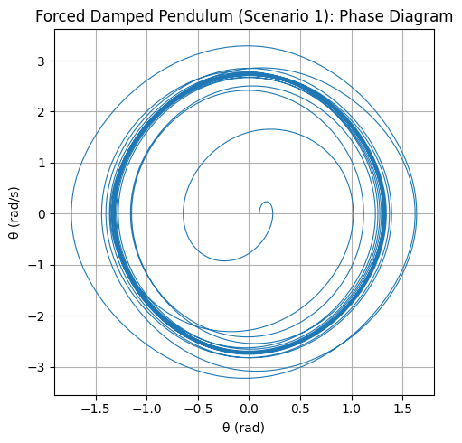
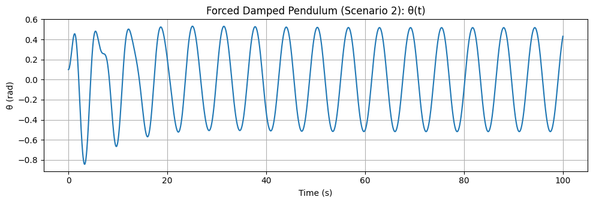
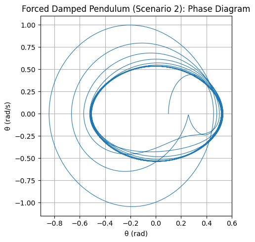

---

# 🎢 **Investigating the Dynamics of a Forced Damped Pendulum**

---

## 🎯 **Motivation**

The **forced damped pendulum** is not just another mechanical system—  
it's a **gateway into the world of complex, nonlinear dynamics**.

When damping and a periodic driving force are both present, something magical happens:  
a simple swing turns into a playground of **resonance, chaos, and quasiperiodicity**.

This makes the system a powerful **analogy** for real-world phenomena like:

- Climate cycles 🌍  
- Vibrating bridges 🌉  
- Electrical circuits ⚡  

So why study this? Because understanding how **a simple pendulum** behaves under stress tells us **how complex systems thrive—or fail**—in the face of repeated forces.

---

## 🧠 **1. Theoretical Foundation**

Let’s start from the fundamental equation that governs the motion:

$$
\frac{d^2\theta}{dt^2} + \gamma \frac{d\theta}{dt} + \omega_0^2 \sin(\theta) = A \cos(\omega t)
$$

Where:
- $\theta(t)$: Angular displacement  
- $\gamma$: Damping coefficient  
- $\omega_0$: Natural frequency  
- $A$: Driving force amplitude  
- $\omega$: Driving frequency  

---

### ✏️ **Small-Angle Approximation**  

When the angle is small $(\theta \ll 1)$, we simplify:

$$
\sin(\theta) \approx \theta
$$

Which gives:

$$
\frac{d^2\theta}{dt^2} + \gamma \frac{d\theta}{dt} + \omega_0^2 \theta = A \cos(\omega t)
$$

This version is linear and lets us dig into analytical solutions.

---

### 🔍 **General Solution**

The full solution is the sum of:

1. **Homogeneous (transient) part**  
2. **Particular (steady-state) part**

**Transient part:**

$$
\theta_{\text{hom}}(t) = e^{-\frac{\gamma}{2} t} \left( C_1 \cos(\Omega t) + C_2 \sin(\Omega t) \right)
$$

Where:

$$
\Omega = \sqrt{\omega_0^2 - \left(\frac{\gamma}{2}\right)^2}
$$

**Steady-state part:**

$$
\theta_{\text{part}}(t) = B \cos(\omega t - \delta)
$$

Amplitude and phase shift are:

$$
B = \frac{A}{\sqrt{(\omega_0^2 - \omega^2)^2 + (\gamma \omega)^2}}, \quad \tan(\delta) = \frac{\gamma \omega}{\omega_0^2 - \omega^2}
$$

---

### 📈 **Resonance: The Sweet Spot of Energy**

Resonance happens when the system **absorbs maximum energy** from the driving force:

$$
\omega_{\text{res}} = \sqrt{\omega_0^2 - \frac{\gamma^2}{2}}
$$

Here, even small forces can cause **large-amplitude** oscillations.  
This is where beauty meets danger in mechanical systems!

---

## 🌀 **2. Analysis of Dynamics**

### 🎛️ Parameter Effects

Let’s see how changing different parameters affects motion:

- **Damping ($\gamma$)**:  
  - High → suppresses motion  
  - Low → enables oscillation and even chaos

- **Driving amplitude ($A$)**:  
  - Low → simple periodic motion  
  - High → system may go chaotic

- **Driving frequency ($\omega$)**:  
  - Near $\omega_0$ → **resonance!**  
  - Far → low amplitude

---

### ⚠️ From Order to Chaos

As you tweak $A$ or $\omega$, the system transitions like this:

1. **Simple periodic motion**  
2. **Quasiperiodic motion**  
3. **Period-doubling**  
4. **Chaos** 🚨

Visualize this with:
- **Phase space plots** $(\theta \text{ vs } \dot{\theta})$
- **Poincaré sections**: snapshot once per cycle
- **Bifurcation diagrams**: to see chaos emerge!

---

## ⚙️ **3. Real-World Applications**

This isn't just theory—it shows up in real life:

- 🧲 **Energy Harvesting**:  
  Tiny vibrations → electricity (like in wearables or smart bridges)

- 🌉 **Suspension Bridges**:  
  Unchecked resonance can cause catastrophic failure  
  (hello, Tacoma Narrows Bridge...)

- ⚡ **Oscillating Circuits**:  
  The pendulum’s math is mirrored in RLC circuits with AC driving.

---

## 🚀 Wrap-Up

The forced damped pendulum is more than a swinging weight—  
it's a **model for complexity, transition, and control**.

Whether you're an engineer, physicist, or just someone who likes watching the world wiggle into chaos—this system's got something for you.


---

## 🔧 4. Implementation: Computational Model 


---

### 🛠️ Common Setup (Run This First)

```python
import numpy as np
import matplotlib.pyplot as plt
from scipy.integrate import solve_ivp

# Pendulum equation
def pendulum_eq(t, y, gamma, omega0, A, omega_drive):
    theta, theta_dot = y
    dtheta_dt = theta_dot
    dtheta_dot_dt = -gamma * theta_dot - omega0**2 * np.sin(theta) + A * np.cos(omega_drive * t)
    return [dtheta_dt, dtheta_dot_dt]

# Plotting functions
def plot_time_series(sol, title):
    plt.figure(figsize=(10, 3.5))
    plt.plot(sol.t, sol.y[0])
    plt.xlabel('Time (s)')
    plt.ylabel('θ (rad)')
    plt.title(title)
    plt.grid(True)
    plt.tight_layout()
    plt.show()

def plot_phase_diagram(sol, title):
    plt.figure(figsize=(5, 5))
    plt.plot(sol.y[0], sol.y[1], lw=0.8)
    plt.xlabel('θ (rad)')
    plt.ylabel('θ̇ (rad/s)')
    plt.title(title)
    plt.grid(True)
    plt.tight_layout()
    plt.show()
```

---

### 1️⃣ Simple Pendulum

```python
# Parameters
gamma = 0.0
A = 0.0
omega0 = 2.0
omega_drive = 0.0  # Not used since A = 0

# Initial conditions and simulation
y0 = [0.2, 0.0]
t_eval = np.linspace(0, 20, 1000)
sol = solve_ivp(pendulum_eq, (0, 20), y0, t_eval=t_eval, args=(gamma, omega0, A, omega_drive))

# Plots
plot_time_series(sol, "Simple Pendulum: θ(t)")
plot_phase_diagram(sol, "Simple Pendulum: Phase Diagram")
```

---





### 2️⃣ Damped Pendulum

```python
gamma = 0.2
A = 0.0
omega0 = 2.0
omega_drive = 0.0

y0 = [0.2, 0.0]
t_eval = np.linspace(0, 20, 1000)
sol = solve_ivp(pendulum_eq, (0, 20), y0, t_eval=t_eval, args=(gamma, omega0, A, omega_drive))

plot_time_series(sol, "Damped Pendulum: θ(t)")
plot_phase_diagram(sol, "Damped Pendulum: Phase Diagram")
```






---

### 3️⃣ Forced Pendulum (No Damping)

```python
gamma = 0.0
A = 1.0
omega0 = 2.0
omega_drive = 1.5

y0 = [0.2, 0.0]
t_eval = np.linspace(0, 100, 3000)
sol = solve_ivp(pendulum_eq, (0, 100), y0, t_eval=t_eval, args=(gamma, omega0, A, omega_drive))

plot_time_series(sol, "Forced Pendulum (No Damping): θ(t)")
plot_phase_diagram(sol, "Forced Pendulum (No Damping): Phase Diagram")
```

---






### 4️⃣ Forced Damped Pendulum – Scenario 1 (Moderate Forcing)

```python
gamma = 0.2
A = 1.2
omega0 = 2.0
omega_drive = 2.0

y0 = [0.1, 0.0]
t_eval = np.linspace(0, 100, 3000)
sol = solve_ivp(pendulum_eq, (0, 100), y0, t_eval=t_eval, args=(gamma, omega0, A, omega_drive))

plot_time_series(sol, "Forced Damped Pendulum (Scenario 1): θ(t)")
plot_phase_diagram(sol, "Forced Damped Pendulum (Scenario 1): Phase Diagram")
```







---

### 5️⃣ Forced Damped Pendulum – Scenario 2 (Stronger Forcing)

```python
gamma = 0.2
A = 1.5
omega0 = 2.0
omega_drive = 1.0

y0 = [0.1, 0.0]
t_eval = np.linspace(0, 100, 3000)
sol = solve_ivp(pendulum_eq, (0, 100), y0, t_eval=t_eval, args=(gamma, omega0, A, omega_drive))

plot_time_series(sol, "Forced Damped Pendulum (Scenario 2): θ(t)")
plot_phase_diagram(sol, "Forced Damped Pendulum (Scenario 2): Phase Diagram")
```




---


