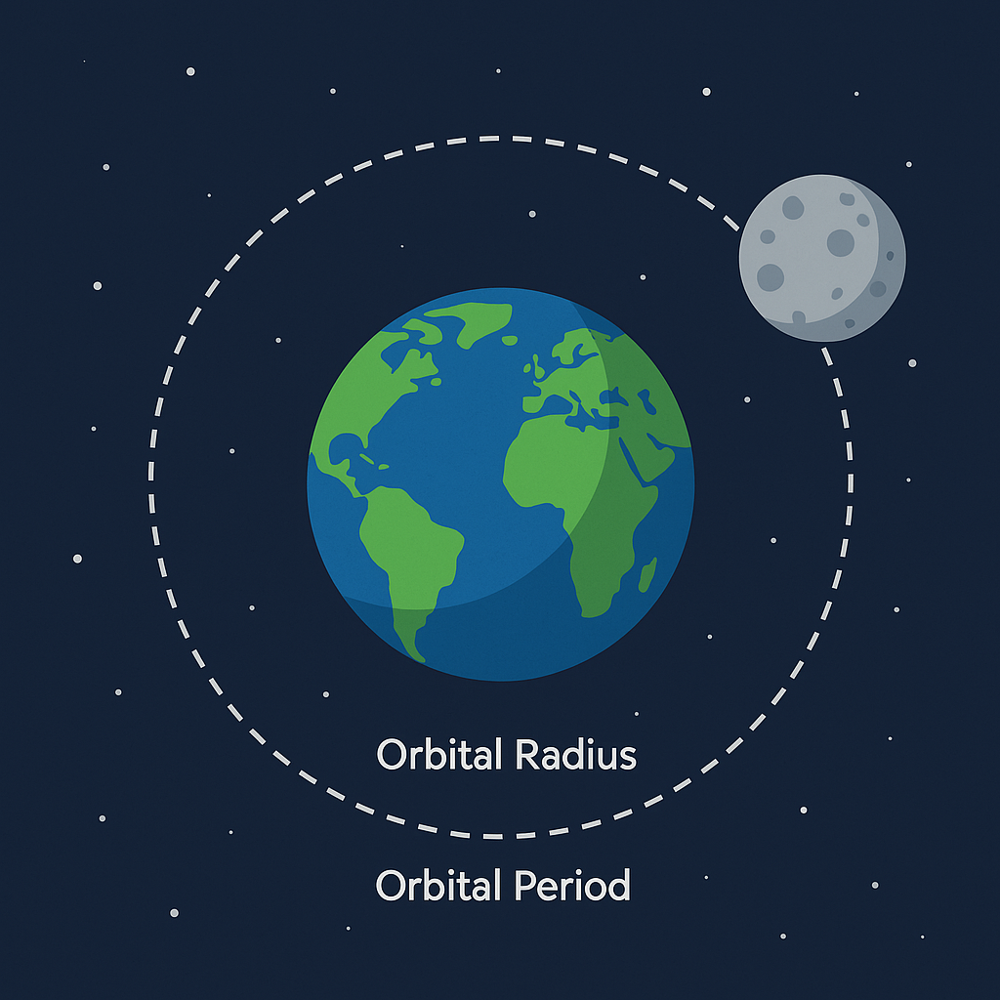
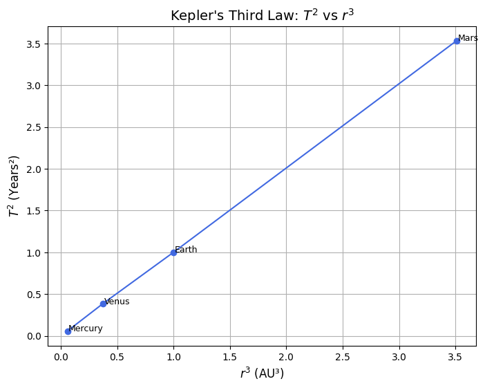
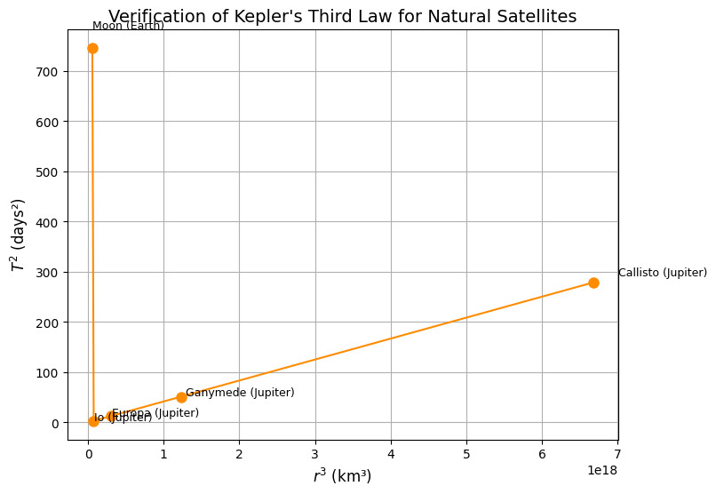

## 🌌 **Kepler’s Third Law: Orbital Period and Orbital Radius**

---

### 🎯 **Motivation**

- Understanding how celestial bodies move helps us decode the structure and mechanics of the universe.
- Kepler’s Third Law offers a beautifully simple way to connect gravity, motion, and distance.
- It's crucial for:
  - Calculating satellite orbits
  - Estimating planetary distances
  - Understanding exoplanet systems

> *“The harmony of the worlds is made manifest in Kepler’s Laws.”*

---

### 📐 **The Core Idea**

For circular orbits:

$$
T^2 \propto r^3
$$

Where:
- \( T \) is the orbital period (time to complete one orbit)
- \( r \) is the orbital radius (distance from the central body)

This means:
> The square of the orbital period is proportional to the cube of the orbital radius.

---

### 🧮 **Derivation of the Law**

Start with Newton's law of gravity and circular motion:

$$
\frac{G M m}{r^2} = \frac{m v^2}{r}
$$

This simplifies to:

$$
v^2 = \frac{G M}{r}
$$

The orbital period \( T \) is the time it takes to complete one orbit, so we can express it as:

$$
T = \frac{2\pi r}{v}
$$

Now substitute \( v^2 \) into this equation:

$$
T^2 = \frac{4\pi^2 r^3}{G M}
$$

✅ This confirms Kepler’s law from first principles!

---

### 🌍 **Real-World Examples**



#### 🌕 The Moon Around Earth
- Radius: \( 3.84 \times 10^8 \, \text{m} \)  
- Period: ~27.3 days  

- $ T^2 \propto r^3 $ holds true!
  

#### ☀️ Planets in the Solar System

| Planet   | Orbital Radius (AU) | Period (Years) | \(T^2/r^3\) |
|----------|----------------------|----------------|-------------|
| Earth    | 1                    | 1              | ~1          |
| Mars     | 1.52                 | 1.88           | ~1          |
| Jupiter  | 5.20                 | 11.86          | ~1          |

🌟 **Conclusion:** The law holds remarkably well across the solar system.

---

### 🔭 **Astronomical Implications**

- **Planet Mass Estimation:** Rearranged formula allows us to calculate the mass of the central body:

$$
M = \frac{4\pi^2 r^3}{G T^2}
$$

- **Satellite Design:** Engineers use this to plan communication orbits, GPS, and space station paths.
- **Exoplanet Detection:** Astronomers infer unseen planets’ orbits and masses using this law!


---

# 🌎☀️ Mass Determination Using Kepler’s Law

Kepler’s Third Law, in its Newtonian form, allows us to calculate the mass of a central body if the orbital radius and period of an orbiting object are known.  
The formula is:

$$
M = \frac{4 \pi^2 r^3}{G T^2}
$$

Where:
- $M$ = Mass of the central object (kg),
- $r$ = Orbital radius (meters),
- $T$ = Orbital period (seconds),
- $G$ = Gravitational constant $(6.67430 \times 10^{-11}\ \text{m}^3 \text{kg}^{-1} \text{s}^{-2})$.

---

## 📍 Finding the Mass of Earth

Using the Moon's orbit:
- Orbital radius: $r = 384,400\ \text{km}$
- Orbital period: $T = 27.32\ \text{days}$

Converting to SI units and applying the formula gives:

$$
M_{\text{Earth}} \approx 5.97 \times 10^{24}\ \text{kg}
$$

This matches the known mass of Earth very closely!

---

## 📍 Finding the Mass of the Sun

Using Earth's orbit around the Sun:
- Orbital radius: $r = 149.6\ \text{million km}$
- Orbital period: $T = 365.25\ \text{days}$

Calculations yield:

$$
M_{\text{Sun}} \approx 1.99 \times 10^{30}\ \text{kg}
$$

Again, this result aligns extremely well with the accepted mass of the Sun.

---

## 🎯 Conclusion

This method shows how Kepler’s Third Law not only describes orbital motion but also enables the calculation of massive celestial bodies, connecting orbital dynamics with fundamental gravitational properties.

---


### 💻 **Simulation & Verification (Python)**

Verification of Kepler's Third Law: T² vs r³
```python
import numpy as np
import matplotlib.pyplot as plt

# Orbital data for inner planets (values in Astronomical Units and Earth years)
planets = ['Mercury', 'Venus', 'Earth', 'Mars']
orbital_radii_au = np.array([0.39, 0.72, 1.00, 1.52])  # Orbital radii (AU)
orbital_periods_years = np.array([0.24, 0.62, 1.00, 1.88])  # Orbital periods (years)

# Compute T^2 and r^3
T_squared = orbital_periods_years ** 2
r_cubed = orbital_radii_au ** 3

# Plotting T^2 vs r^3
plt.figure(figsize=(8,6))
plt.plot(r_cubed, T_squared, 'o-', color='royalblue')

# Annotate planets on the plot
for i, planet in enumerate(planets):
    plt.text(r_cubed[i] + 0.01, T_squared[i], planet, fontsize=9)

# Labels and title
plt.xlabel(r'$r^3$ (AU³)', fontsize=12)
plt.ylabel(r'$T^2$ (Years²)', fontsize=12)
plt.title('Kepler\'s Third Law: $T^2$ vs $r^3$', fontsize=14)
plt.grid(True)

# Show the plot
plt.show()

```



Verification of Kepler's Third Law for Natural Satellites
```python

import numpy as np
import matplotlib.pyplot as plt

# Orbital data for natural satellites
# Distance from the planet center in kilometers (km)
orbital_radii_km = np.array([384400, 421700, 671100, 1070400, 1882700])

# Orbital periods in days
orbital_periods_days = np.array([27.32, 1.77, 3.55, 7.15, 16.69])

# Names of the moons
moons = ['Moon (Earth)', 'Io (Jupiter)', 'Europa (Jupiter)', 'Ganymede (Jupiter)', 'Callisto (Jupiter)']

# Calculate T^2 and r^3
T_squared = orbital_periods_days ** 2
r_cubed = orbital_radii_km ** 3

# Create the plot
plt.figure(figsize=(8,6))
plt.plot(r_cubed, T_squared, 'o-', color='darkorange', markersize=8)

# Annotate each moon
for i, moon in enumerate(moons):
    plt.text(r_cubed[i]*1.05, T_squared[i]*1.05, moon, fontsize=9)

# Add labels and title
plt.xlabel(r'$r^3$ (km³)', fontsize=12)
plt.ylabel(r'$T^2$ (days²)', fontsize=12)
plt.title('Verification of Kepler\'s Third Law for Natural Satellites', fontsize=14)
plt.grid(True)

# Show the plot
plt.show()
```




---

> **Explanation:**  
> The plot shows that natural satellites, like the Moon and Jupiter’s Galilean moons, obey Kepler’s Third Law. It confirms that $T^2$ and $r^3$ are proportional for all orbiting systems, not just planets around stars.


---

### 🌠 **Conclusion**

- Kepler’s Third Law is a powerful bridge between **observational astronomy** and **Newtonian physics**.
- Its simplicity hides immense depth, powering everything from moon missions to exoplanet discovery.
- Understanding it means understanding the **rhythm of the cosmos**.

---


