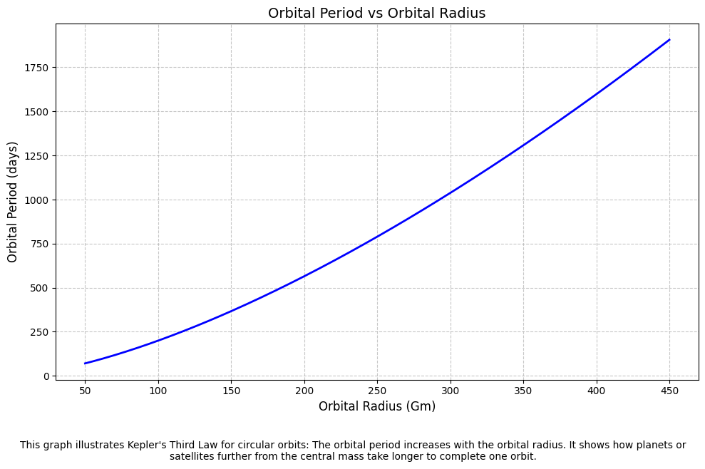

## 🌌 **Kepler’s Third Law: Orbital Period and Orbital Radius**

---

### 🎯 **Motivation**

- Understanding how celestial bodies move helps us decode the structure and mechanics of the universe.
- Kepler’s Third Law offers a beautifully simple way to connect gravity, motion, and distance.
- It's crucial for:
  - Calculating satellite orbits
  - Estimating planetary distances
  - Understanding exoplanet systems

> *“The harmony of the worlds is made manifest in Kepler’s Laws.”*

---

### 📐 **The Core Idea**

For circular orbits:

$$
T^2 \propto r^3
$$

Where:
- \( T \) is the orbital period (time to complete one orbit)
- \( r \) is the orbital radius (distance from the central body)

This means:
> The square of the orbital period is proportional to the cube of the orbital radius.

---

### 🧮 **Derivation of the Law**

Start with Newton's law of gravity and circular motion:

$$
\frac{G M m}{r^2} = \frac{m v^2}{r}
$$

This simplifies to:

$$
v^2 = \frac{G M}{r}
$$

The orbital period \( T \) is the time it takes to complete one orbit, so we can express it as:

$$
T = \frac{2\pi r}{v}
$$

Now substitute \( v^2 \) into this equation:

$$
T^2 = \frac{4\pi^2 r^3}{G M}
$$

✅ This confirms Kepler’s law from first principles!

---

### 🌍 **Real-World Examples**


#### 🌕 The Moon Around Earth
- Radius: \( 3.84 \times 10^8 \, \text{m} \)  
- Period: ~27.3 days  
- $ T^2 \propto r^3 $ holds true!
  

#### ☀️ Planets in the Solar System

| Planet   | Orbital Radius (AU) | Period (Years) | \(T^2/r^3\) |
|----------|----------------------|----------------|-------------|
| Earth    | 1                    | 1              | ~1          |
| Mars     | 1.52                 | 1.88           | ~1          |
| Jupiter  | 5.20                 | 11.86          | ~1          |

🌟 **Conclusion:** The law holds remarkably well across the solar system.

---

### 🔭 **Astronomical Implications**

- **Planet Mass Estimation:** Rearranged formula allows us to calculate the mass of the central body:

$$
M = \frac{4\pi^2 r^3}{G T^2}
$$

- **Satellite Design:** Engineers use this to plan communication orbits, GPS, and space station paths.
- **Exoplanet Detection:** Astronomers infer unseen planets’ orbits and masses using this law!

---

### 💻 **Simulation & Verification (Python)**


---

### ✅ **Python Code with Graph and Explanation**

```python
import numpy as np
import matplotlib.pyplot as plt

# Constants
G = 6.67430e-11  # Gravitational constant (m^3 kg^-1 s^-2)

def orbital_period(mass_central_body, orbital_radius):
    """
    Calculate orbital period using Kepler's 3rd Law.
    
    Parameters:
        mass_central_body (float): Mass of the central object (kg)
        orbital_radius (float): Orbital radius (m)
        
    Returns:
        float: Orbital period in seconds
    """
    return 2 * np.pi * np.sqrt(orbital_radius**3 / (G * mass_central_body))

def plot_orbital_period_vs_radius(mass_central_body, r_min, r_max, points=200):
    """
    Plot orbital period vs orbital radius for a given central body mass.
    
    Parameters:
        mass_central_body (float): Mass of the central body (kg)
        r_min (float): Minimum orbital radius (m)
        r_max (float): Maximum orbital radius (m)
        points (int): Number of points in the plot
    """
    # Generate radius values
    radii = np.linspace(r_min, r_max, points)
    
    # Compute corresponding periods
    periods = [orbital_period(mass_central_body, r) for r in radii]
    periods_days = np.array(periods) / 86400  # convert seconds to days

    # Plot
    plt.figure(figsize=(10, 6))
    plt.plot(radii / 1e9, periods_days, color='blue', linewidth=2)
    plt.xlabel("Orbital Radius (Gm)", fontsize=12)  # Gm = gigameters
    plt.ylabel("Orbital Period (days)", fontsize=12)
    plt.title("Orbital Period vs Orbital Radius", fontsize=14)
    plt.grid(True, linestyle='--', alpha=0.7)
    plt.tight_layout()

    # Explanation below the graph
    plt.figtext(0.5, -0.08,
                "This graph illustrates Kepler's Third Law for circular orbits: "
                "The orbital period increases with the orbital radius. "
                "It shows how planets or satellites further from the central mass "
                "take longer to complete one orbit.",
                wrap=True, horizontalalignment='center', fontsize=10)

    plt.show()

# Example: Using the Sun's mass
mass_of_sun = 1.989e30  # kg
r_min = 5e10  # 50 million km (Mercury-like orbit)
r_max = 4.5e11  # 450 million km (beyond Mars)

plot_orbital_period_vs_radius(mass_of_sun, r_min, r_max)
```

---

### 📊 **What You'll See**
- **X-axis**: Orbital radius in gigameters (Gm, i.e., billions of meters)
- **Y-axis**: Orbital period in days
- **Graph Trend**: Gently curving upward — because as the orbital radius increases, the period increases (slower orbits)





---

### 🌠 **Conclusion**

- Kepler’s Third Law is a powerful bridge between **observational astronomy** and **Newtonian physics**.
- Its simplicity hides immense depth, powering everything from moon missions to exoplanet discovery.
- Understanding it means understanding the **rhythm of the cosmos**.

---


