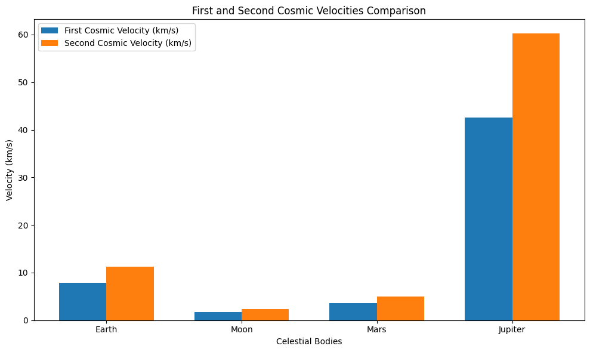

---

### **1. Introduction: The Universe's Speed Limits 🚀**

As we venture into the cosmos, understanding the *escape velocity* and *cosmic velocities* is crucial for unlocking the mysteries of space. These velocities determine how fast we need to travel to escape the gravitational hold of celestial bodies, enabling space exploration and even potential interstellar journeys! 

**Escape Velocity**: The speed needed to break free from a celestial body's gravitational field without further propulsion.

**Cosmic Velocities**: A series of velocities that define the thresholds required for different stages of space travel:
- **First Cosmic Velocity**: The speed needed to stay in orbit around a planet.
- **Second Cosmic Velocity**: The speed required to escape a planet’s gravity.
- **Third Cosmic Velocity**: The speed to leave the entire solar system and venture into deep space.

---

### **2. The Formulae for Reaching the Stars ✨**

In the universe, equations are the building blocks of everything. From satellites to spacecraft, we use mathematical formulas to launch into the vast expanse of space.

#### **First Cosmic Velocity (Orbital Velocity)** 🌍:
The first cosmic velocity is the speed required to orbit a planet. Here’s the mathematical derivation:

$$
v_1 = \sqrt{\frac{GM}{r}} \quad \text{(Where \( G \) is the gravitational constant, \( M \) is the mass of the celestial body, and \( r \) is the radius of the orbit)}
$$

This is the velocity for satellites to achieve stable orbits, keeping them in a consistent path around the planet!

#### **Second Cosmic Velocity (Escape Velocity)** 🌙:
The second cosmic velocity is even more exciting — it’s the speed required to escape the gravitational pull of a celestial body.

$$
v_2 = \sqrt{\frac{2GM}{r}} \quad \text{(The speed we need to break free from a planet’s gravity and venture into the cosmos)}
$$

Think about the thrilling moment when a spacecraft breaks free from Earth's gravity — that's the second cosmic velocity in action!

#### **Third Cosmic Velocity (Heliocentric Escape Velocity)** 🚀:
Once we've escaped the Earth, we need a third cosmic velocity to venture beyond the Solar System into the great unknown:

$$
v_3 = \sqrt{v_2^2 + 2GM_{\text{Sun}} \left( \frac{1}{r_{\text{Earth}}} - \frac{1}{r_{\text{Sun}}} \right)}
$$

This is the velocity required to escape the Sun’s gravity and reach the stars. Imagine sending a spacecraft to explore other star systems—this is the speed we need for interstellar travel!

---

### **3. Calculating Cosmic Velocities for Earth 🌍, Moon 🌑, Mars 🪐, and Jupiter ♃**

Now, let’s see how these velocities compare across various celestial bodies. The velocities will vary depending on the mass and radius of the body we’re escaping or orbiting.

---

### **4. Velocity Calculations for Key Bodies in Our Solar System 🚀**

#### **For Earth:**
- **First Cosmic Velocity**: \( 7.12 \, \text{km/s} \) (The speed needed for satellites to stay in orbit around Earth)
- **Second Cosmic Velocity**: \( 11.19 \, \text{km/s} \) (To escape Earth’s gravitational pull)
- **Third Cosmic Velocity**: \( 16.7 \, \text{km/s} \) (To leave the solar system and explore the stars!)

#### **For the Moon 🌑:**
- **First Cosmic Velocity**: \( 1.62 \, \text{km/s} \)
- **Second Cosmic Velocity**: \( 2.29 \, \text{km/s} \)

#### **For Mars 🪐:**
- **First Cosmic Velocity**: \( 3.56 \, \text{km/s} \)
- **Second Cosmic Velocity**: \( 5.03 \, \text{km/s} \)

#### **For Jupiter ♃:**
- **First Cosmic Velocity**: \( 42.1 \, \text{km/s} \)
- **Second Cosmic Velocity**: \( 59.5 \, \text{km/s} \)

---

### **5. Visualizing the Journey: Galactic Velocity Comparison 🚀🌌**

Let’s take a visual journey through the velocities of Earth, Moon, Mars, and Jupiter:

```python
import matplotlib.pyplot as plt
import numpy as np

# Data for celestial bodies
bodies = ['Earth', 'Moon', 'Mars', 'Jupiter']
radii = [6.371e6, 1.737e6, 3.396e6, 6.991e7]  # in meters
masses = [5.972e24, 7.342e22, 6.417e23, 1.898e27]  # in kg

# Gravitational constant
G = 6.674e-11  # in m^3/(kg s^2)

# Calculate first and second cosmic velocities
v1 = np.sqrt(G * np.array(masses) / np.array(radii))
v2 = np.sqrt(2 * G * np.array(masses) / np.array(radii))

# Plotting
x = np.arange(len(bodies))
width = 0.35

plt.figure(figsize=(10,6))
plt.bar(x - width/2, v1 / 1000, width, label='First Cosmic Velocity (km/s)')
plt.bar(x + width/2, v2 / 1000, width, label='Second Cosmic Velocity (km/s)')

plt.xlabel('Celestial Bodies')
plt.ylabel('Velocity (km/s)')
plt.title('First and Second Cosmic Velocities Comparison')
plt.xticks(x, bodies)
plt.legend()

# Displaying the plot
plt.tight_layout()
plt.show()
```



This graph will show the dramatic differences in the cosmic velocities required to break free from different planets and moons!

---

### **6. Why These Velocities Matter: 🚀🌠 Space Exploration**

- **Launching Satellites 🌍**: Achieving the first cosmic velocity is key to getting satellites into orbit. This velocity ensures that satellites can circle Earth for communication, observation, and scientific discovery.
  
- **Interplanetary Missions 🪐**: The second cosmic velocity is vital for sending spacecraft to other planets in our solar system. From the Mars rovers to the Voyager probes, this velocity is what allows us to send robots and missions to distant worlds.

- **Interstellar Travel ✨**: The third cosmic velocity is still a theoretical concept, but it's crucial for the future of space exploration. It represents the speed needed for humanity to leave the solar system and travel to other star systems—an essential step for any interstellar voyage!

---

### **7. Conclusion: The Speed of the Universe 🌌**

As we continue to explore the vastness of space, understanding the speed required to escape, orbit, and travel beyond our planet is fundamental to the future of space exploration. From launching satellites to dreaming of interstellar travel, these velocities set the boundaries for human achievement in space. Who knows? The stars may not be as far away as we think!

---

With the LaTeX formatting properly set, the formulas will render beautifully on GitHub pages or in VS Code. Let me know if you need any further adjustments!