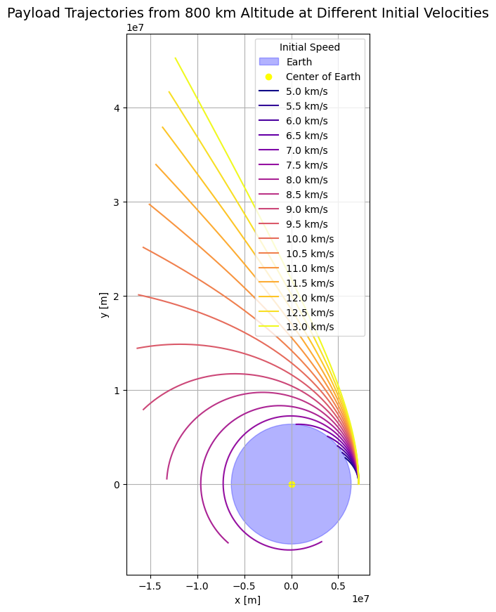

### **Presentation: Trajectories of a Freely Released Payload Near Earth**

---


####  Introduction
- **Objective:** Analyze the trajectories of a payload released near Earth under different initial conditions.
- **Key Questions:**
  - How do initial velocity and altitude affect the trajectory?
  - What types of orbits (elliptical, parabolic, hyperbolic) can occur?
  - How does this relate to real-world applications like satellite deployment and escape missions?

---

####  Fundamental Concepts
- **Newton's Law of Gravitation:**
  $$
  F = G \frac{m_1 m_2}{r^2}
  $$
  - Describes the force between two masses.
- **Kepler's Laws:**
  - Elliptical orbits with Earth at one focus.
  - Equal areas swept in equal times.
  - Period squared proportional to semi-major axis cubed.
- **Escape Velocity:**
  $$
  v_{\text{escape}} = \sqrt{\frac{2GM}{r}}
  $$
  - Minimum velocity to escape Earth's gravity.

---

####  Types of Trajectories
- **Elliptical Orbit:** Bound orbit with negative total energy ($E < 0$).
- **Parabolic Trajectory:** Boundary condition for escape ($E = 0$).
- **Hyperbolic Trajectory:** Unbound orbit with positive total energy ($E > 0$).

---

####  Numerical Simulation Overview
- **Approach:**
  - Solve equations of motion using numerical integration.
  - Use Python with `scipy.integrate.solve_ivp`.
- **Equations of Motion:**
  $$
  \frac{d\mathbf{r}}{dt} = \mathbf{v}, \quad \frac{d\mathbf{v}}{dt} = -\frac{GM}{r^3} \mathbf{r}.
  $$

---

### **Graph 1: Trajectories with Varying Velocities**
#### **Python Code for Graph 1**
```python
import numpy as np
from scipy.integrate import solve_ivp
import matplotlib.pyplot as plt

# Constants
G = 6.674e-11  # Gravitational constant (m^3 kg^-1 s^-2)
M = 5.972e24   # Mass of Earth (kg)
R_Earth = 6371e3  # Radius of Earth (m)

# Equations of motion
def equations_of_motion(t, state):
    x, y, vx, vy = state
    r = np.sqrt(x**2 + y**2)
    ax = -G * M * x / r**3
    ay = -G * M * y / r**3
    return [vx, vy, ax, ay]

# Simulate trajectory
def simulate_trajectory(initial_velocity, initial_position, t_span, t_eval):
    state0 = [initial_position[0], initial_position[1], 0, initial_velocity]
    sol = solve_ivp(equations_of_motion, t_span, state0, t_eval=t_eval)
    return sol.y[0], sol.y[1]

# Plotting
def plot_case_1():
    altitudes = [300e3] * 6  # Altitude in meters
    velocities = [7800, 7900, 8000, 8100, 8200, 8300]  # Velocity in m/s
    colors = ['blue', 'orange', 'green', 'red', 'purple', 'brown']
    labels = [f'Trajectory {i+1}' for i in range(6)]
    
    t_span = (0, 5000)  # 5000 seconds
    t_eval = np.linspace(t_span[0], t_span[1], 1000)
    
    fig, ax = plt.subplots(figsize=(8, 8))
    earth_radius = R_Earth
    circle = plt.Circle((0, 0), earth_radius, color='blue', alpha=0.3, label="Earth")
    ax.add_patch(circle)
    plt.scatter(0, 0, color='yellow', s=50, label="Center of Earth")
    
    for i in range(len(velocities)):
        initial_position = [R_Earth + altitudes[i], 0]
        x, y = simulate_trajectory(velocities[i], initial_position, t_span, t_eval)
        plt.plot(x, y, color=colors[i], label=labels[i])
    
    plt.title("Trajectories in a Gravitational Field with Filled Earth")
    plt.xlabel("x [m]")
    plt.ylabel("y [m]")
    plt.axis('equal')
    plt.legend()
    plt.grid()
    plt.show()

# Run the plot
plot_case_1()
```


#### **Explanation of Graph 1**
- **Observations:**
  - **Trajectory 1 (Blue):** Circular orbit at 7800 m/s.
  - **Trajectories 2-5:** Elliptical orbits as velocity increases.
  - **Trajectory 6 (Brown):** Hyperbolic trajectory at 8300 m/s.
- **Insights:** Increasing velocity changes the orbit from circular to elliptical to hyperbolic.


---

### 🔭 **Python Code: Payload Trajectories from 800 km Altitude**

```python
import numpy as np
from scipy.integrate import solve_ivp
import matplotlib.pyplot as plt

# Constants
G = 6.674e-11         # Gravitational constant (m^3 kg^-1 s^-2)
M = 5.972e24          # Mass of Earth (kg)
R_EARTH = 6371e3      # Radius of Earth (m)
ALTITUDE = 800e3      # Initial altitude above Earth's surface (800 km)

# Equations of motion under gravity
def equations_of_motion(t, state):
    x, y, vx, vy = state
    r = np.sqrt(x**2 + y**2)
    ax = -G * M * x / r**3
    ay = -G * M * y / r**3
    return [vx, vy, ax, ay]

# Event: detect collision with Earth
def hit_earth(t, state):
    x, y, _, _ = state
    r = np.sqrt(x**2 + y**2)
    return r - R_EARTH

hit_earth.terminal = True  # Stop integration if this event is triggered
hit_earth.direction = -1   # Only trigger when approaching Earth

# Simulate trajectory for given initial speed
def simulate_trajectory(initial_speed, t_span, t_eval):
    x0 = R_EARTH + ALTITUDE  # Starting from surface + altitude (along x-axis)
    y0 = 0
    vx0 = 0
    vy0 = initial_speed      # Launch straight up
    initial_state = [x0, y0, vx0, vy0]
    sol = solve_ivp(
        equations_of_motion, t_span, initial_state,
        t_eval=t_eval, events=hit_earth
    )
    return sol.y[0], sol.y[1]

# Plotting the trajectories
def plot_trajectories():
    velocities = np.arange(5000, 13500, 500)  # From 5 km/s to 13 km/s
    colors = plt.cm.plasma(np.linspace(0, 1, len(velocities)))
    t_span = (0, 5000)
    t_eval = np.linspace(*t_span, 1000)

    fig, ax = plt.subplots(figsize=(10, 10))

    # Draw Earth
    earth = plt.Circle((0, 0), R_EARTH, color='blue', alpha=0.3, label="Earth")
    ax.add_patch(earth)
    ax.scatter(0, 0, color='yellow', label="Center of Earth")

    # Plot each trajectory
    for i, v in enumerate(velocities):
        x, y = simulate_trajectory(v, t_span, t_eval)
        label = f'{v/1000:.1f} km/s'
        ax.plot(x, y, color=colors[i], label=label)

    ax.set_title("Payload Trajectories from 800 km Altitude at Different Initial Velocities", fontsize=14)
    ax.set_xlabel("x [m]")
    ax.set_ylabel("y [m]")
    ax.set_aspect('equal')
    ax.grid(True)
    ax.legend(title="Initial Speed")
    plt.show()

# Run the plot
plot_trajectories()
```




---

### 📌 **Graph Title:**
> **"Payload Trajectories from 800 km Altitude at Different Initial Velocities"**

---

### 📘 **What the Graph Shows  :**

- The plot illustrates the paths (trajectories) of a payload launched **from 800 km above Earth's surface**, starting from the right side of the Earth.
- Each colored curve corresponds to a **different initial launch speed**, ranging from **5 km/s to 13 km/s**.
- **At lower velocities (e.g., 5 km/s)**, the payload **falls back to Earth** due to insufficient energy.
- **At moderate velocities (7–8 km/s)**, it enters **elliptical or circular orbits**, staying gravitationally bound to Earth.
- **At high velocities (above ~11.2 km/s)**, it follows a **hyperbolic trajectory**, meaning it **escapes Earth's gravitational pull**.

---


#### **Slide 6: Real-World Applications**
- **Satellite Deployment:** Precise control of velocity ensures stable orbits.
- **Reentry Missions:** Understanding deceleration is crucial for safe reentry.
- **Interplanetary Missions:** Hyperbolic trajectories for escaping Earth's gravity.

---

####  Conclusion
- **Key Takeaways:**
  - Initial velocity and altitude determine the type of trajectory.
  - Elliptical, parabolic, and hyperbolic orbits represent different energy states.
  - Numerical simulations provide insights into complex gravitational dynamics.
- **Future Work:**
  - Include atmospheric drag for more realistic models.
  - Explore multi-body interactions for planetary exploration.

---


### **Bonus Slide: Fun Fact**
- **Did You Know?**
  - The International Space Station orbits Earth at about 7.66 km/s.
  - A slight increase in velocity could send it on an escape trajectory!

---


###  Fun Fact - Escape Velocity
**Title:** 🚀 Fun Fact: Escape Velocity  
**Content:**
- **Escape Velocity on Earth:** $11,186 \, \text{m/s}$ (about $40,270 \, \text{km/h}$).
- **Fun Comparison:** If you could drive a car at this speed, you'd go around the world in just over **1 hour**!
- **Visual:** A cartoon car speeding around the globe with a "Whoosh!" sound effect.

---

###  Interactive Quiz
**Title:** 🤔 Quiz Time!  
**Question:** What happens if you release a payload from a rocket moving at exactly escape velocity?  
**Options:**
1. It orbits Earth in a perfect circle.
2. It follows a parabolic trajectory.
3. It escapes Earth's gravity immediately.
4. It falls back to Earth.

**Answer:**  
- **Correct Answer:** 2. It follows a parabolic trajectory.  
- **Explanation:** At exactly escape velocity, the payload has enough energy to escape Earth's gravity but not enough to move away indefinitely—it follows a parabolic path.

**Visual:** A rocket releasing a payload with a trajectory animation.

---

###  Real-Life Example - Apollo Missions
**Title:** 🌕 Real-Life Application: Apollo Missions  
**Content:**
- The Apollo missions used precise calculations of trajectories to:
  - Launch from Earth.
  - Enter lunar orbit.
  - Return safely to Earth.
- **Key Trajectory Types Used:**
  - **Elliptical Orbit:** To reach the Moon.
  - **Hyperbolic Trajectory:** For returning to Earth.


---

###  Gravity Well Visualization
**Title:** 🌍 Gravity Well Visualization  
**Content:**
- **Concept:** Imagine Earth as a deep well. Objects fall into the well unless they have enough energy to climb out.
- **Visual:** A 3D gravity well diagram showing how different velocities affect the path of an object:
  - Low velocity: Falls back into the well (Earth).
  - High velocity: Escapes the well.

**Python Code for Gravity Well Visualization :**
```python
import numpy as np
import matplotlib.pyplot as plt
from mpl_toolkits.mplot3d import Axes3D

# Create a grid of points
theta = np.linspace(0, 2 * np.pi, 100)
phi = np.linspace(0, np.pi, 100)
theta, phi = np.meshgrid(theta, phi)

# Radius of the gravity well
r = 1 / (1 + 0.5 * np.sin(phi))

# Convert spherical coordinates to Cartesian
x = r * np.sin(phi) * np.cos(theta)
y = r * np.sin(phi) * np.sin(theta)
z = r * np.cos(phi)

# Plot
fig = plt.figure(figsize=(8, 8))
ax = fig.add_subplot(111, projection='3d')
ax.plot_surface(x, y, z, cmap='viridis')

ax.set_title("Gravity Well Visualization")
ax.set_xlabel("X-axis")
ax.set_ylabel("Y-axis")
ax.set_zlabel("Z-axis")

plt.show()
```


---


###  Summary
**Title:** 📝 Summary  
**Key Points:**
1. Initial conditions (velocity and altitude) determine the type of trajectory.
2. Elliptical, parabolic, and hyperbolic orbits represent different energy states.
3. Numerical simulations help predict and visualize complex gravitational dynamics.
4. Real-world applications include satellite deployment, reentry missions, and interplanetary travel.

**Takeaway:** Understanding trajectories is crucial for successful space missions!

---


### **Bonus Slide: Space Joke**
**Title:** 😄 Space Joke  
**Joke:** Why did the astronaut break up with their partner?  
**Answer:** They needed space!  

---

