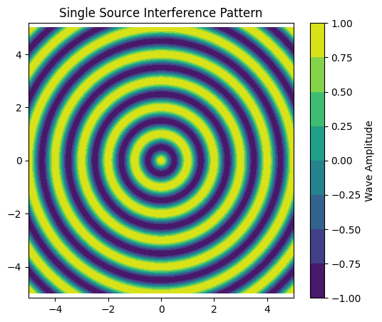
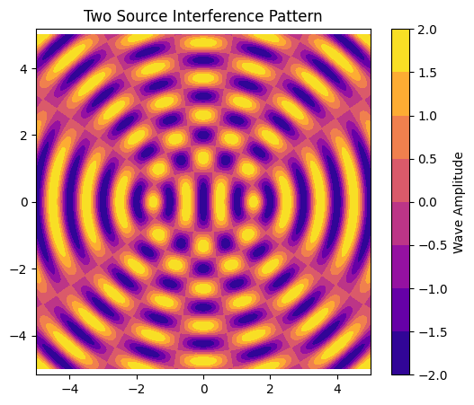
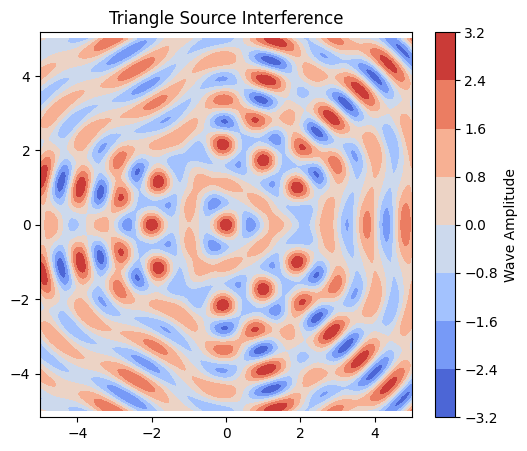
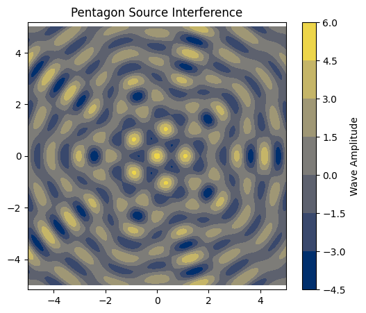

# 🌊 Interference Patterns on a Water Surface

**Simulating Wave Superposition from Point Sources in Regular Polygons**

---

## 🎯 Motivation

Interference occurs when waves from different sources meet and combine. On a water surface, these patterns are easy to visualize as ripples intersect. This project explores how multiple wave sources positioned at the vertices of a regular polygon create beautiful and informative interference patterns.

We study this using:

* Mathematical modeling of wave propagation
* Superposition of wave equations
* Visualizations using heatmaps and animations

---

## 📐 Wave Model

A circular wave on the water surface from a source at $(x_0, y_0)$ is described by:

$$
n(x, y, t) = A \cos(kr - \omega t + \phi)
$$

Where:

* $A$: Amplitude (same for all)
* $k = \frac{2\pi}{\lambda}$: Wave number
* $\omega = 2\pi f$: Angular frequency
* $r = \sqrt{(x - x_0)^2 + (y - y_0)^2}$: Distance to the source
* $\phi$: Initial phase (constant across sources)

---

## 🧪 Python Simulation Setup

We'll simulate wave patterns for:

* One source
* Two sources
* Multiple sources forming triangle and pentagon


## 🧠 Python Code: Core Functions

```python
import numpy as np
import matplotlib.pyplot as plt
from matplotlib import cm
from matplotlib.animation import FuncAnimation, PillowWriter

# Wave parameters
A = 1          # Amplitude
f = 1          # Frequency (Hz)
λ = 1          # Wavelength
k = 2 * np.pi / λ
ω = 2 * np.pi * f
φ = 0          # Phase

# Grid
x = np.linspace(-5, 5, 400)
y = np.linspace(-5, 5, 400)
X, Y = np.meshgrid(x, y)

def wave_from_source(x0, y0, t):
    R = np.sqrt((X - x0)**2 + (Y - y0)**2) + 1e-6  # avoid zero division
    return A * np.cos(k * R - ω * t + φ)

def total_wave(sources, t):
    return sum(wave_from_source(x0, y0, t) for (x0, y0) in sources)
```

---

## 🌊 Visualizing a Single Source

```python
plt.figure(figsize=(6,5))
plt.contourf(X, Y, wave_from_source(0, 0, 0), cmap='viridis')
plt.title("Single Source Interference Pattern")
plt.colorbar(label='Wave Amplitude')
plt.axis('equal')
plt.show()
```

---

## 🌊 Two Sources Interference

```python
sources = [(-1.5, 0), (1.5, 0)]
plt.figure(figsize=(6,5))
plt.contourf(X, Y, total_wave(sources, 0), cmap='plasma')
plt.title("Two Source Interference Pattern")
plt.colorbar(label='Wave Amplitude')
plt.axis('equal')
plt.show()
```

---

## 🔺 Triangle Interference Pattern

```python
# Equilateral triangle sources
r = 2
triangle_sources = [(r*np.cos(θ), r*np.sin(θ)) for θ in [0, 2*np.pi/3, 4*np.pi/3]]

plt.figure(figsize=(6,5))
plt.contourf(X, Y, total_wave(triangle_sources, 0), cmap='coolwarm')
plt.title("Triangle Source Interference")
plt.colorbar(label='Wave Amplitude')
plt.axis('equal')
plt.show()
```

---

## 🔷 Pentagon Interference Pattern

```python
# Pentagon sources
r = 2
pentagon_sources = [(r*np.cos(θ), r*np.sin(θ)) for θ in np.linspace(0, 2*np.pi, 5, endpoint=False)]

plt.figure(figsize=(6,5))
plt.contourf(X, Y, total_wave(pentagon_sources, 0), cmap='cividis')
plt.title("Pentagon Source Interference")
plt.colorbar(label='Wave Amplitude')
plt.axis('equal')
plt.show()
```

---

## 🎥 Animation (GIF) of Wave Interference

```python
import numpy as np
import matplotlib.pyplot as plt
from matplotlib.animation import FuncAnimation, PillowWriter
from IPython.display import HTML, Image
import base64
import os

# Wave parameters
A = 1
f = 1
λ = 1
k = 2 * np.pi / λ
ω = 2 * np.pi * f
φ = 0

# Grid
x = np.linspace(-5, 5, 400)
y = np.linspace(-5, 5, 400)
X, Y = np.meshgrid(x, y)

def wave_from_source(x0, y0, t):
    R = np.sqrt((X - x0)**2 + (Y - y0)**2) + 1e-6
    return A * np.cos(k * R - ω * t + φ)

def total_wave(sources, t):
    return sum(wave_from_source(x0, y0, t) for (x0, y0) in sources)

# Pentagon source example
r = 2
sources = [(r * np.cos(theta), r * np.sin(theta)) for theta in np.linspace(0, 2*np.pi, 5, endpoint=False)]

# Create animation
fig, ax = plt.subplots(figsize=(6,6))
cax = ax.imshow(np.zeros_like(X), extent=[-5, 5, -5, 5], cmap='inferno', animated=True)
fig.colorbar(cax, ax=ax, label='Amplitude')
ax.set_title("Wave Interference Animation")

def update(frame):
    t = frame * 0.1
    Z = total_wave(sources, t)
    cax.set_array(Z)
    ax.set_title(f"t = {t:.2f} s")
    return [cax]

ani = FuncAnimation(fig, update, frames=60, blit=True)

# Save GIF
gif_path = "wave_interference.gif"
ani.save(gif_path, writer=PillowWriter(fps=10))
plt.close()

# Display GIF
with open(gif_path, "rb") as f:
    data = f.read()

data_url = "data:image/gif;base64," + base64.b64encode(data).decode()
display(HTML(f''))

# Optional download link
from google.colab import files
files.download(gif_path)
```

---

## 🧠 Observations & Analysis

### ✅ Constructive Interference:

Occurs when wave crests from different sources meet — resulting in **higher amplitude**.

### ❌ Destructive Interference:

Occurs when a crest meets a trough — resulting in **near-zero displacement**.

* **Single Source:** Concentric circular ripples.
* **Two Sources:** Alternating bands of constructive/destructive interference.
* **Triangle/Pentagon:** Symmetric floral patterns due to coherent superposition — more complex as sources increase.

---


## ✅ Conclusion

This simulation visually captures the essence of **wave interference** and **superposition** principles using simple mathematical models. As more sources are added in symmetrical arrangements, the complexity and beauty of the patterns grow — reinforcing the link between geometry and physics.

---


