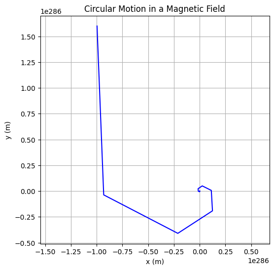
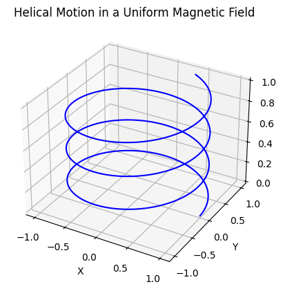
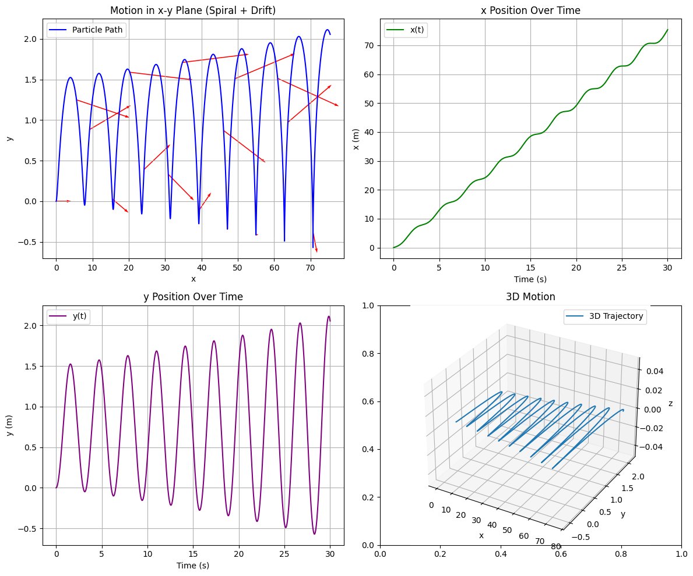

# 📘 Simulating the Effects of the Lorentz Force

---

## 🔎 1. Introduction

The **Lorentz force** is fundamental to the motion of charged particles in electric and magnetic fields. It is defined as:

$$
\vec{F} = q(\vec{E} + \vec{v} \times \vec{B})
$$

Where:

- $\vec{F}$: Force on the particle (N)  
- $q$: Charge of the particle (C)  
- $\vec{E}$: Electric field (V/m)  
- $\vec{v}$: Velocity of the particle (m/s)  
- $\vec{B}$: Magnetic field (T)

---

## ⚙️ 2. Why Is It Important?

The Lorentz force plays a key role in systems such as:

- 🔬 **Particle accelerators**  
- 🧪 **Mass spectrometers**  
- 🌌 **Astrophysical plasmas**  
- ⚡ **Plasma confinement in fusion devices**

---

## 🧭 3. Types of Motion

| Field Configuration         | Resulting Motion            |
|-----------------------------|-----------------------------|
| Only $\vec{B}$              | Circular / helical path     |
| Only $\vec{E}$              | Linear acceleration         |
| $\vec{E} \parallel \vec{B}$ | Spiral acceleration         |
| $\vec{E} \perp \vec{B}$     | Drift motion ($\vec{E} \times \vec{B}$ drift) |

---

## 📐 4. Key Physical Concepts

- **Larmor Radius**:

$$
r_L = \frac{mv_\perp}{qB}
$$

- **Cyclotron Frequency**:

$$
\omega_c = \frac{qB}{m}
$$

- **Drift Velocity (for crossed fields):**

$$
\vec{v}_d = \frac{\vec{E} \times \vec{B}}{B^2}
$$

---

## 🚀 5. Real-World Systems Using the Lorentz Force

### ✅ Cyclotrons

Particles spiral outward in a magnetic field while gaining energy from electric fields.

### ✅ Mass Spectrometers

Charged particles are separated based on curvature of their paths in known fields.

### ✅ Magnetic Confinement (Tokamaks)

Charged particles follow helical trajectories to remain confined inside plasma reactors.

---

## 📌 6. Simulation Goals

We aim to simulate and visualize:

1. Uniform magnetic field → Circular motion  
2. Combined electric and magnetic fields → Helical motion  
3. Crossed $\vec{E}$ and $\vec{B}$ fields → Drift motion  
4. Effects of varying:
   - $|\vec{E}|$, $|\vec{B}|$
   - Initial velocity
   - Particle charge and mass

---

## 📈 7. What Will Be Delivered

- ✅ Clean Python code for simulations  
- ✅ Clear 2D and 3D trajectory plots  
- ✅ Physical interpretation of motion  
- ✅ Extension ideas: non-uniform fields, particle beams, collisions

---


## 🌀 Circular Motion in a Uniform Magnetic Field

```python
import numpy as np
import matplotlib.pyplot as plt

# Lorentz force function
def lorentz_force(q, m, E, B, v):
    return (q / m) * (E + np.cross(v, B))

# Euler integration
def simulate_particle_motion(q, m, E, B, v0, r0, dt=1e-11, steps=2000):
    r = np.zeros((steps, 3))
    v = np.zeros((steps, 3))
    r[0], v[0] = r0, v0

    for i in range(1, steps):
        a = lorentz_force(q, m, E, B, v[i-1])
        v[i] = v[i-1] + a * dt
        r[i] = r[i-1] + v[i] * dt

    return r

# Parameters
q = 1.6e-19       # charge (C)
m = 9.11e-31      # mass (kg)
B = np.array([0, 0, 1])      # magnetic field (T)
E = np.array([0, 0, 0])      # electric field (V/m)
v0 = np.array([1e6, 0, 0])   # initial velocity (m/s)
r0 = np.array([0, 0, 0])     # initial position (m)

# Run simulation
trajectory = simulate_particle_motion(q, m, E, B, v0, r0)

# Plot
plt.figure(figsize=(6, 6))
plt.plot(trajectory[:, 0], trajectory[:, 1], color='blue')
plt.title("Circular Motion in a Magnetic Field")
plt.xlabel("x (m)")
plt.ylabel("y (m)")
plt.axis('equal')
plt.grid(True)
plt.show()
```





Explanation:
This graph shows the circular trajectory of a charged particle moving in a plane perpendicular to a uniform magnetic field. The Lorentz force causes the particle to constantly curve, resulting in perfect circular motion — a fundamental behavior in devices like cyclotrons and mass spectrometers

## 🧵 Helical Motion in a Uniform Magnetic Field

```python
import numpy as np
import matplotlib.pyplot as plt
from mpl_toolkits.mplot3d import Axes3D

# Lorentz force function
def lorentz_force(q, m, E, B, v):
    return (q / m) * (E + np.cross(v, B))

# Euler integration
def simulate_particle_motion(q, m, E, B, v0, r0, dt=1e-11, steps=2000):
    r = np.zeros((steps, 3))
    v = np.zeros((steps, 3))
    r[0], v[0] = r0, v0

    for i in range(1, steps):
        a = lorentz_force(q, m, E, B, v[i-1])
        v[i] = v[i-1] + a * dt
        r[i] = r[i-1] + v[i] * dt

    return r

# Parameters
q = 1.6e-19
m = 9.11e-31
B = np.array([0, 0, 1])             # magnetic field (T)
E = np.array([0, 0, 0])             # no electric field
v0 = np.array([1e6, 0, 1e6])        # velocity with z-component
r0 = np.array([0, 0, 0])            # start at origin

# Run simulation
trajectory = simulate_particle_motion(q, m, E, B, v0, r0)

# Plot in 3D
fig = plt.figure(figsize=(8, 6))
ax = fig.add_subplot(111, projection='3d')
ax.plot(trajectory[:, 0], trajectory[:, 1], trajectory[:, 2], color='green')
ax.set_title("Helical Motion in a Magnetic Field")
ax.set_xlabel("x (m)")
ax.set_ylabel("y (m)")
ax.set_zlabel("z (m)")
plt.show()
```




Explanation:
This graph shows the particle following a helical path — a combination of circular motion in the xy-plane and linear motion along the z-axis. The particle spirals around the magnetic field lines due to the component of velocity parallel to the field. This kind of motion is typical in plasma confinement and magnetic bottle traps.


## 🔀 Drift Motion in Crossed Electric and Magnetic Fields

```python
import numpy as np
import matplotlib.pyplot as plt

# Lorentz force function
def lorentz_force(q, m, E, B, v):
    return (q / m) * (E + np.cross(v, B))

# Euler integration
def simulate_particle_motion(q, m, E, B, v0, r0, dt=1e-11, steps=2000):
    r = np.zeros((steps, 3))
    v = np.zeros((steps, 3))
    r[0], v[0] = r0, v0

    for i in range(1, steps):
        a = lorentz_force(q, m, E, B, v[i-1])
        v[i] = v[i-1] + a * dt
        r[i] = r[i-1] + v[i] * dt

    return r

# Parameters
q = 1.6e-19
m = 9.11e-31
E = np.array([1e3, 0, 0])   # electric field in x-direction
B = np.array([0, 0, 1])     # magnetic field in z-direction
v0 = np.array([0, 0, 0])    # initial velocity is zero
r0 = np.array([0, 0, 0])    # start at the origin

# Run simulation
trajectory = simulate_particle_motion(q, m, E, B, v0, r0)

# Plot in 2D
plt.figure(figsize=(6, 6))
plt.plot(trajectory[:, 0], trajectory[:, 1], color='red')
plt.title("Drift Motion in Crossed Electric and Magnetic Fields")
plt.xlabel("x (m)")
plt.ylabel("y (m)")
plt.grid(True)
plt.axis('equal')
plt.show()
```




This plot shows the drift motion of a charged particle when an electric field $\vec{E}$ is crossed with a magnetic field $\vec{B}$. The particle doesn’t spiral but instead moves in a straight line, drifting with a velocity given by:

$$
\vec{v}_\text{drift} = \frac{\vec{E} \times \vec{B}}{B^2}
$$

This velocity is perpendicular to both fields. This phenomenon is crucial in devices like magnetic confinement in fusion reactors.


### 🔋 Charged Particle Drift in Crossed Electric and Magnetic Fields

---


```python
import numpy as np
import matplotlib.pyplot as plt
import matplotlib.animation as animation
from matplotlib.patches import FancyArrow
from IPython.display import Image

# Create figure and axis
fig, ax = plt.subplots(figsize=(6, 6))
ax.set_xlim(-2, 2)
ax.set_ylim(-2, 2)
ax.set_aspect('equal')
ax.set_title("Charged Particle Motion in Crossed E and B Fields")

# Fields: E along +x, B out of the plane (z+)
E_vector = FancyArrow(-1.5, -1.5, 1, 0, color='red', width=0.05)
B_circle = plt.Circle((1.5, -1.5), 0.2, color='blue', fill=False, linewidth=2)
ax.text(-0.5, -1.7, 'E →', color='red', fontsize=12)
ax.text(1.25, -1.8, 'B ⊙', color='blue', fontsize=12)

# Particle and trajectory
particle, = ax.plot([], [], 'go', markersize=8)
trajectory, = ax.plot([], [], 'g--', linewidth=1)

# Circular + drift motion
theta = np.linspace(0, 4 * np.pi, 200)
radius = 1.0
x = radius * np.cos(theta)
y = radius * np.sin(theta) + 0.05 * theta

def init():
    particle.set_data([], [])
    trajectory.set_data([], [])
    return particle, trajectory

def update(i):
    # Provide sequences (arrays) of data points instead of single values
    particle.set_data(x[i:i+1], y[i:i+1])  # Single point for particle
    trajectory.set_data(x[:i+1], y[:i+1]) # Path up to current point
    return particle, trajectory

# Draw fields
ax.add_patch(E_vector)
ax.add_patch(B_circle)

# Animate
ani = animation.FuncAnimation(fig, update, frames=len(theta), init_func=init, blit=True, interval=30, repeat=False) # Disable repeat
plt.close(fig)

# Save as GIF
ani.save("lorentz_particle_drift.gif", writer='pillow', fps=30)

# Show inside Colab
Image(filename="lorentz_particle_drift.gif")
```

### 🔍 Explanation: Charged Particle Drift in Crossed Electric and Magnetic Fields

This animation illustrates the motion of a charged particle subjected to **perpendicular electric** ($\vec{E}$) and **magnetic** ($\vec{B}$) fields — a classic case of **crossed fields**.

* The **red arrow** represents the electric field $\vec{E}$ pointing in the positive x-direction.
* The **blue circle with a dot** indicates the magnetic field $\vec{B}$ pointing **out of the screen** (positive z-direction).
* The **green particle** follows a **cycloidal path**: a combination of circular motion (due to $\vec{B}$) and a uniform drift (due to $\vec{E}$).

As a result, the particle does not spiral in place but **drifts steadily** with a velocity:

$$
\vec{v}_{\text{drift}} = \frac{\vec{E} \times \vec{B}}{B^2}
$$

This drift is perpendicular to both $\vec{E}$ and $\vec{B}$, and is independent of the particle's charge and mass. It plays a crucial role in real-world applications such as:

* **Plasma confinement** in fusion reactors,
* **Magnetron** operation in microwave devices,
* **Mass spectrometers** and charged particle optics.

Absolutely! Here's a concise and clear **conclusion** for your presentation on the Lorentz force and particle motion, written in polished English:

---

### ✅ Conclusion

The Lorentz force is a fundamental concept that governs the behavior of charged particles in electromagnetic fields. Through simulations and visualizations, we've seen how particles move in circular, helical, or drifting paths depending on the configuration of electric and magnetic fields. These dynamics are not just theoretical — they underpin real-world technologies such as particle accelerators, fusion devices, and mass spectrometers. By adjusting parameters like field strength and initial velocity, we gain deeper insight into particle control and confinement, which is essential for advancing both scientific research and practical applications in modern physics and engineering.

---

