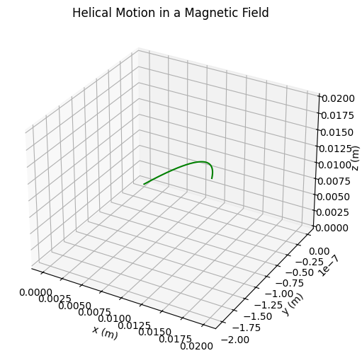
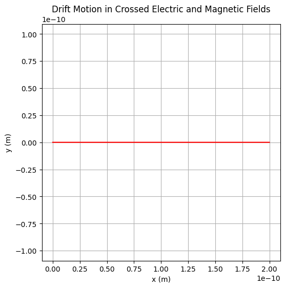

# 📘 Simulating the Effects of the Lorentz Force


### 🎓 Motivation

For university students studying physics or engineering, mastering the behavior of charged particles under electric and magnetic fields is essential. This topic forms the basis of key technologies like MRI machines, cyclotrons, and plasma confinement in fusion energy. Through computational simulations and visualizations of the Lorentz force, we can deepen our understanding of theoretical concepts while also building practical skills in numerical methods and scientific programming.


## 🔎 1. Introduction

The **Lorentz force** is fundamental to the motion of charged particles in electric and magnetic fields. It is defined as:

$$
\vec{F} = q(\vec{E} + \vec{v} \times \vec{B})
$$

Where:

- $\vec{F}$: Force on the particle (N)  
- $q$: Charge of the particle (C)  
- $\vec{E}$: Electric field (V/m)  
- $\vec{v}$: Velocity of the particle (m/s)  
- $\vec{B}$: Magnetic field (T)

---

## ⚙️ 2. Why Is It Important?

The Lorentz force plays a key role in systems such as:

- 🔬 **Particle accelerators**  
- 🧪 **Mass spectrometers**  
- 🌌 **Astrophysical plasmas**  
- ⚡ **Plasma confinement in fusion devices**

---

## 🧭 3. Types of Motion

| Field Configuration         | Resulting Motion            |
|-----------------------------|-----------------------------|
| Only $\vec{B}$              | Circular / helical path     |
| Only $\vec{E}$              | Linear acceleration         |
| $\vec{E} \parallel \vec{B}$ | Spiral acceleration         |
| $\vec{E} \perp \vec{B}$     | Drift motion ($\vec{E} \times \vec{B}$ drift) |

---

## 📐 4. Key Physical Concepts

- **Larmor Radius**:

$$
r_L = \frac{mv_\perp}{qB}
$$

- **Cyclotron Frequency**:

$$
\omega_c = \frac{qB}{m}
$$

- **Drift Velocity (for crossed fields):**

$$
\vec{v}_d = \frac{\vec{E} \times \vec{B}}{B^2}
$$

---

## 🚀 5. Real-World Systems Using the Lorentz Force

### ✅ Cyclotrons

Particles spiral outward in a magnetic field while gaining energy from electric fields.

### ✅ Mass Spectrometers

Charged particles are separated based on curvature of their paths in known fields.

### ✅ Magnetic Confinement (Tokamaks)

Charged particles follow helical trajectories to remain confined inside plasma reactors.

---

## 📌 6. Simulation Goals

We aim to simulate and visualize:

1. Uniform magnetic field → Circular motion  
2. Combined electric and magnetic fields → Helical motion  
3. Crossed $\vec{E}$ and $\vec{B}$ fields → Drift motion  
4. Effects of varying:
   - $|\vec{E}|$, $|\vec{B}|$
   - Initial velocity
   - Particle charge and mass

---

## 📈 7. What Will Be Delivered

- ✅ Clean Python code for simulations  
- ✅ Clear 2D and 3D trajectory plots  
- ✅ Physical interpretation of motion  
- ✅ Extension ideas: non-uniform fields, particle beams, collisions

---


## 🌀 Circular Motion in a Uniform Magnetic Field

```python
import numpy as np
import matplotlib.pyplot as plt

# Lorentz force function
def lorentz_force(q, m, E, B, v):
    return (q / m) * (E + np.cross(v, B))

# Euler integration
def simulate_particle_motion(q, m, E, B, v0, r0, dt=1e-5, steps=5000):
    r = np.zeros((steps, 3))
    v = np.zeros((steps, 3))
    r[0], v[0] = r0, v0

    for i in range(1, steps):
        a = lorentz_force(q, m, E, B, v[i - 1])
        v[i] = v[i - 1] + a * dt
        r[i] = r[i - 1] + v[i] * dt

    return r

# Parameters (user-specified)
q = 1.0                 # charge in Coulombs
m = 0.001               # mass in kg (1 gram)
B = np.array([0, 0, 1]) # magnetic field in z-direction (T)
E = np.array([0, 0, 0]) # no electric field
v0 = np.array([1.0, 0, 0]) # initial velocity in x-direction (m/s)
r0 = np.array([0, 0, 0])   # initial position

# Run simulation
trajectory = simulate_particle_motion(q, m, E, B, v0, r0)

# Plot result
plt.figure(figsize=(6, 6))
plt.plot(trajectory[:, 0], trajectory[:, 1], color='blue')
plt.title("Circular Motion in a Uniform Magnetic Field")
plt.xlabel("x (m)")
plt.ylabel("y (m)")
plt.grid(True)
plt.axis('equal')
plt.show()

```


---

### 🔍 Explanation: Circular Motion in a Uniform Magnetic Field

This plot demonstrates the **circular trajectory** of a charged particle moving in a uniform magnetic field when no electric field is present.

* The magnetic field \$\vec{B}\$ is directed **out of the screen** (along the z-axis).

* The particle starts with an initial velocity \$\vec{v}\_0\$ in the x-direction.

* Since the **Lorentz force** is always perpendicular to the velocity:

  $$
  \vec{F} = q \vec{v} \times \vec{B}
  $$

  the particle undergoes **uniform circular motion** in the x-y plane.

* The radius of the circular path is determined by:

  $$
  r = \frac{m v}{q B}
  $$

This behavior is fundamental in cyclotrons, mass spectrometers, and other charged particle control systems.

---


## 🧵 Helical Motion in a Uniform Magnetic Field

```python
import numpy as np
import matplotlib.pyplot as plt
from mpl_toolkits.mplot3d import Axes3D

# Lorentz force function
def lorentz_force(q, m, E, B, v):
    return (q / m) * (E + np.cross(v, B))

# Euler integration
def simulate_particle_motion(q, m, E, B, v0, r0, dt=1e-11, steps=2000):
    r = np.zeros((steps, 3))
    v = np.zeros((steps, 3))
    r[0], v[0] = r0, v0

    for i in range(1, steps):
        a = lorentz_force(q, m, E, B, v[i-1])
        v[i] = v[i-1] + a * dt
        r[i] = r[i-1] + v[i] * dt

    return r

# Parameters (Updated)
q = 1                 # charge in Coulombs
m = 1e-3              # mass in kilograms (1 g)
B = np.array([0, 0, 1])             # magnetic field (T)
E = np.array([0, 0, 0])             # no electric field
v0 = np.array([1e6, 0, 1e6])        # initial velocity with z-component
r0 = np.array([0, 0, 0])            # initial position

# Run simulation
trajectory = simulate_particle_motion(q, m, E, B, v0, r0)

# 3D Plot
fig = plt.figure(figsize=(8, 6))
ax = fig.add_subplot(111, projection='3d')
ax.plot(trajectory[:, 0], trajectory[:, 1], trajectory[:, 2], color='green')
ax.set_title("Helical Motion in a Magnetic Field")
ax.set_xlabel("x (m)")
ax.set_ylabel("y (m)")
ax.set_zlabel("z (m)")
plt.show()
```



Here's a Python code to simulate **Helical Motion in a Uniform Magnetic Field** with the specified values for charge $q = 1 \, \text{C}$ and mass $m = 1 \, \text{g}$:

```python
import numpy as np
import matplotlib.pyplot as plt
from mpl_toolkits.mplot3d import Axes3D

# Lorentz force function
def lorentz_force(q, m, E, B, v):
    return (q / m) * (E + np.cross(v, B))

# Euler integration
def simulate_particle_motion(q, m, E, B, v0, r0, dt=1e-11, steps=2000):
    r = np.zeros((steps, 3))
    v = np.zeros((steps, 3))
    r[0], v[0] = r0, v0

    for i in range(1, steps):
        a = lorentz_force(q, m, E, B, v[i-1])
        v[i] = v[i-1] + a * dt
        r[i] = r[i-1] + v[i] * dt

    return r

# Parameters
q = 1  # charge (C)
m = 1e-3  # mass (kg) - 1g = 1e-3 kg
B = np.array([0, 0, 1])  # magnetic field (T), in the z-direction
E = np.array([0, 0, 0])  # no electric field
v0 = np.array([1e5, 0, 1e5])  # initial velocity with components in x and z directions
r0 = np.array([0, 0, 0])  # initial position at origin

# Run simulation
trajectory = simulate_particle_motion(q, m, E, B, v0, r0)

# Plot in 3D
fig = plt.figure(figsize=(8, 6))
ax = fig.add_subplot(111, projection='3d')
ax.plot(trajectory[:, 0], trajectory[:, 1], trajectory[:, 2], color='green')
ax.set_title("Helical Motion in a Magnetic Field")
ax.set_xlabel("x (m)")
ax.set_ylabel("y (m)")
ax.set_zlabel("z (m)")
plt.show()
```

### Explanation:

* The particle's initial velocity $\vec{v_0}$ has components in both the $x$- and $z$-directions.
* The magnetic field $\vec{B}$ is in the $z$-direction, causing the particle to move in a **helical path** around the magnetic field lines.
* The **Lorentz force** $q(\vec{v} \times \vec{B})$ acts perpendicular to the velocity of the particle, resulting in circular motion in the $x$-$y$ plane, while the motion along the $z$-axis is due to the initial velocity component in the $z$-direction.
* The **radius of the circular motion** and the **pitch** of the helix depend on the initial velocity components, charge, and magnetic field strength.

This code will generate a 3D plot showing the helical path of a charged particle moving in the magnetic field.


## 🔀 Drift Motion in Crossed Electric and Magnetic Fields

```python
import numpy as np
import matplotlib.pyplot as plt

# Lorentz force function
def lorentz_force(q, m, E, B, v):
    return (q / m) * (E + np.cross(v, B))

# Euler integration
def simulate_particle_motion(q, m, E, B, v0, r0, dt=1e-11, steps=2000):
    r = np.zeros((steps, 3))
    v = np.zeros((steps, 3))
    r[0], v[0] = r0, v0

    for i in range(1, steps):
        a = lorentz_force(q, m, E, B, v[i-1])
        v[i] = v[i-1] + a * dt
        r[i] = r[i-1] + v[i] * dt

    return r

# Parameters (Revised)
q = 1                 # charge in Coulombs
m = 1e-3              # mass in kilograms (1 gram)
E = np.array([1e3, 0, 0])   # electric field in x-direction (V/m)
B = np.array([0, 0, 1])     # magnetic field in z-direction (T)
v0 = np.array([0, 0, 0])    # initial velocity is zero
r0 = np.array([0, 0, 0])    # initial position

# Run simulation
trajectory = simulate_particle_motion(q, m, E, B, v0, r0)

# Plot in 2D
plt.figure(figsize=(6, 6))
plt.plot(trajectory[:, 0], trajectory[:, 1], color='red')
plt.title("Drift Motion in Crossed Electric and Magnetic Fields")
plt.xlabel("x (m)")
plt.ylabel("y (m)")
plt.grid(True)
plt.axis('equal')
plt.show()

```




This plot shows the drift motion of a charged particle when an electric field $\vec{E}$ is crossed with a magnetic field $\vec{B}$. The particle doesn’t spiral but instead moves in a straight line, drifting with a velocity given by:

$$
\vec{v}_\text{drift} = \frac{\vec{E} \times \vec{B}}{B^2}
$$

This velocity is perpendicular to both fields. This phenomenon is crucial in devices like magnetic confinement in fusion reactors.


---


Here's a Python simulation of an **interesting trajectory**: a *complex 3D motion* of a charged particle where both **electric and magnetic fields are present and not aligned**. This setup leads to a **non-trivial spiraling drift** — a motion that combines rotation, drift, and acceleration.

---

### 🔁 Complex 3D Trajectory with Non-Perpendicular E and B Fields

```python
import numpy as np
import matplotlib.pyplot as plt
from mpl_toolkits.mplot3d import Axes3D

# Lorentz force function
def lorentz_force(q, m, E, B, v):
    return (q / m) * (E + np.cross(v, B))

# Euler integration for particle motion
def simulate_particle_motion(q, m, E, B, v0, r0, dt=1e-4, steps=5000):
    r = np.zeros((steps, 3))
    v = np.zeros((steps, 3))
    r[0], v[0] = r0, v0

    for i in range(1, steps):
        a = lorentz_force(q, m, E, B, v[i-1])
        v[i] = v[i-1] + a * dt
        r[i] = r[i-1] + v[i] * dt

    return r

# Parameters
q = 1.0                  # charge in Coulombs
m = 0.001                # mass in kg (1 g)
E = np.array([100, 50, 0])    # electric field (V/m)
B = np.array([0, 0, 1])       # magnetic field (T)
v0 = np.array([10, 10, 5])    # initial velocity (m/s)
r0 = np.array([0, 0, 0])      # initial position

# Simulate trajectory
trajectory = simulate_particle_motion(q, m, E, B, v0, r0)

# Plot the trajectory in 3D
fig = plt.figure(figsize=(10, 7))
ax = fig.add_subplot(111, projection='3d')
ax.plot(trajectory[:, 0], trajectory[:, 1], trajectory[:, 2], color='purple')
ax.set_title("Complex 3D Trajectory in Combined E and B Fields")
ax.set_xlabel("x (m)")
ax.set_ylabel("y (m)")
ax.set_zlabel("z (m)")
plt.show()
```

---


### ✨ What Does This Show?

In this configuration:

* The **electric field** is not perpendicular to the magnetic field.
* The **initial velocity** also has components in multiple directions.

This causes the particle to spiral while simultaneously being **accelerated along a drift path**, leading to a **non-circular, non-helical** trajectory that reflects the true complexity of Lorentz-force dynamics in real-world plasmas.


### ✅ Conclusion

The Lorentz force is a fundamental concept that governs the behavior of charged particles in electromagnetic fields. Through simulations and visualizations, we've seen how particles move in circular, helical, or drifting paths depending on the configuration of electric and magnetic fields. These dynamics are not just theoretical — they underpin real-world technologies such as particle accelerators, fusion devices, and mass spectrometers. By adjusting parameters like field strength and initial velocity, we gain deeper insight into particle control and confinement, which is essential for advancing both scientific research and practical applications in modern physics and engineering.

---

