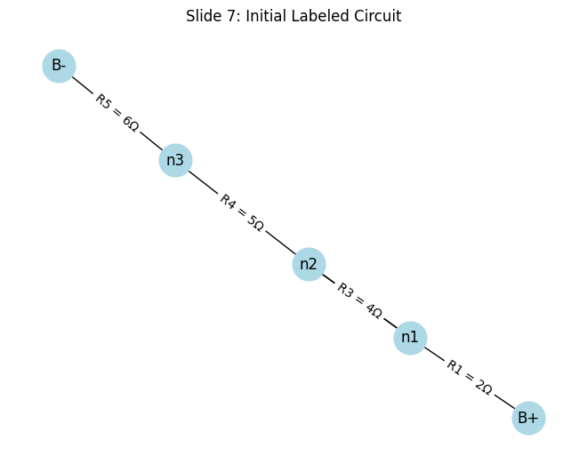
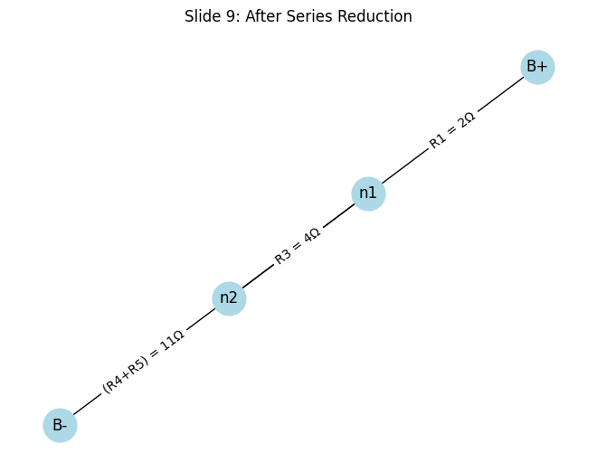
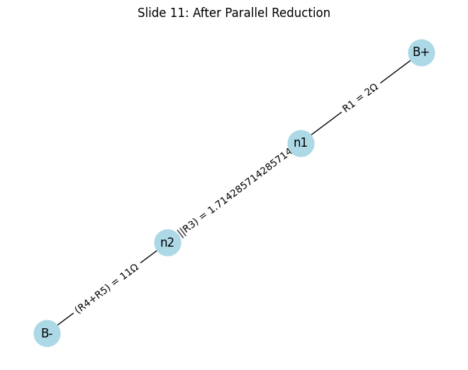
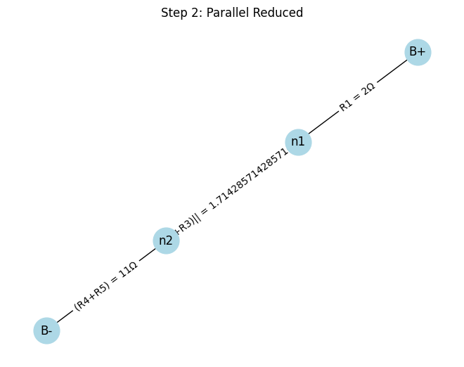
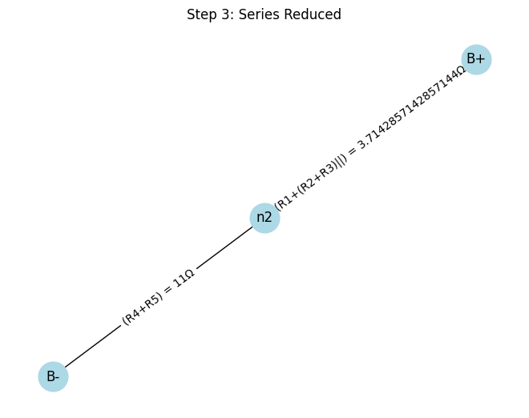
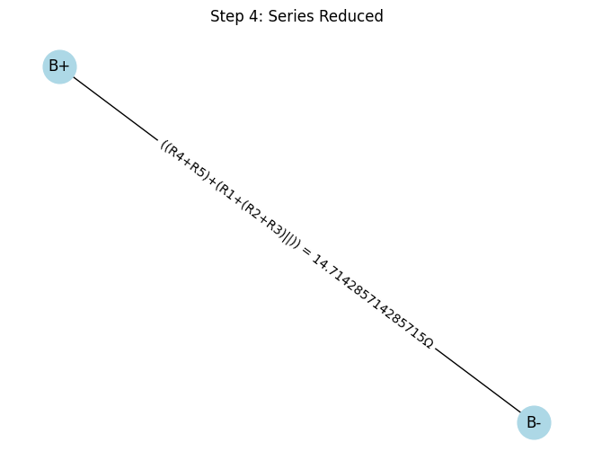
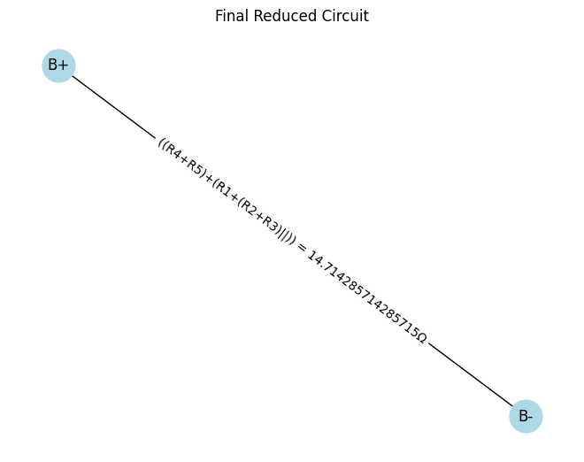

## 🎓 **Slide 1: Title Slide**

* **Title**: **Equivalent Resistance Using Graph Theory**
* **Subtitle**: *A Systematic Approach to Simplifying Complex Circuits*


📽 *Animation Suggestion*: Fade-in for title and subtitle, with a background image of a complex circuit.

---

## 💡 **Slide 2: Motivation**

### **Why Use Graph Theory for Equivalent Resistance?**

* Traditional series/parallel rules become messy in complex circuits.
* Graph theory offers a structured, algorithmic approach.
* Powerful for:

  * Circuit simulation tools
  * Optimization engines
  * Educational purposes

📈 *Visual*: Show a tangled resistor network vs. a neat graph.

---

## 🔗 **Slide 3: Key Concept — Circuits as Graphs**

### **Graph Representation:**

* **Nodes** → Junctions
* **Edges** → Resistors (weights = resistance)

🖼️ *Visual Aid*: Circuit diagram on the left, graph on the right (linked by arrows).

🧠 *Analogy*: Think of it like a road network with travel cost = resistance.

---

## ⚙️ **Slide 4: Algorithm Overview**

### **Step-by-Step Plan**

```python
function compute_equivalent_resistance(graph, source, sink):
    while number_of_edges(graph) > 1:
        detect all series pairs
        if any found:
            replace each series pair with an equivalent resistor
        else:
            detect all parallel pairs
            replace each parallel pair with an equivalent resistor
    return resistance between source and sink
```

🧭 *Goal*: Reduce the graph to a single edge between source and sink.

---

## 🧪 **Slide 5: Case Study Introduction**

### **We’ll Walk Through an Example Circuit**

* Circuit with resistors: $R_1, R_2, R_3, R_4, R_5$
* **Source**: $B+$, **Sink**: $B-$

🖼️ *Visual*: Realistic resistor diagram with labels.

---

## 📊 **Slide 6: Graph Representation**

### **Graph Version of the Circuit**

* **Nodes**: $B+, n_1, n_2, n_3, n_4, B-$
* **Edges**: Represent resistors with weights

👁️ *Visual*: `networkx`-based graph visualization

---

## 🧑‍💻 **Slide 7: Python Code — Graph Creation**

### **Initial Circuit Graph with `networkx`**

```python
import networkx as nx
import matplotlib.pyplot as plt

G = nx.Graph()
edges = [
    ('B+', 'n1', 2),
    ('n1', 'n2', 3),
    ('n1', 'n3', 4),
    ('n2', 'n3', 5),
    ('n2', 'B-', 6),
    ('n3', 'B-', 7)
]

for u, v, r in edges:
    G.add_edge(u, v, resistance=r)

pos = nx.spring_layout(G)
nx.draw(G, pos, with_labels=True, node_color='lightblue', node_size=800)
labels = nx.get_edge_attributes(G, 'resistance')
nx.draw_networkx_edge_labels(G, pos, edge_labels={k: f"{v}Ω" for k, v in labels.items()})
plt.title("Initial Circuit Graph")
plt.show()
```

📸 *Output*: Rendered interactive graph image.

---

## 🔄 **Slide 8: Step 1 — Series Reduction**

### **Detect and Replace Series Resistors**

* Example: $R_2$ and $R_3$ in series → $R_{23} = R_2 + R_3$

🛠️ *Visual*: Before/after graph with series highlighted.

---

## 🧑‍💻 **Slide 9: Python Code — Series Detection**

```python
def find_series_pairs(graph):
    series_pairs = []
    for node in graph.nodes:
        if graph.degree[node] == 2:
            neighbors = list(graph.neighbors(node))
            if len(neighbors) == 2:
                u, v = neighbors
                r1 = graph[u][node]['resistance']
                r2 = graph[v][node]['resistance']
                series_pairs.append((u, node, v, r1 + r2))
    return series_pairs

def merge_series_resistors(graph, u, mid, v, new_r):
    graph.add_edge(u, v, resistance=new_r)
    graph.remove_node(mid)
```


🎬 *Action*: Highlight which node gets removed in visualization.

---

## 🧲 **Slide 10: Step 2 — Parallel Reduction**

### **Detect and Replace Parallel Resistors**

* Formula: $R_{eq} = \frac{R_1 \cdot R_2}{R_1 + R_2}$

🔁 *Visual*: Two edges between same nodes → one edge

---

## 🧑‍💻 **Slide 11: Python Code — Parallel Detection**

```python
from collections import defaultdict

def find_parallel_pairs(graph):
    edge_counts = defaultdict(list)
    for u, v, data in graph.edges(data=True):
        edge_counts[frozenset((u, v))].append(data['resistance'])

    parallels = []
    for nodes, resistances in edge_counts.items():
        if len(resistances) > 1:
            u, v = tuple(nodes)
            R_eq = 1 / sum(1/r for r in resistances)
            parallels.append((u, v, R_eq))
    return parallels

def merge_parallel_resistors(graph, u, v, new_r):
    graph.remove_edges_from([(u, v)] * graph.number_of_edges(u, v))
    graph.add_edge(u, v, resistance=new_r)
```

📌 *Tip*: Use multigraphs for actual multiple edges, or simulate via attributes.

---

## ✅ **Slide 12: Final Reduction**

### **When Only One Edge Remains**

* Only edge between $B+$ and $B-$
* This edge's weight = total equivalent resistance

🧠 *Key Insight*: Reduction is recursive and deterministic.

---

## 🧩 **Slide 13: Full Function — All-in-One Solver**

```python
def compute_equivalent_resistance(graph, source, sink):
    step = 1
    while True:
        series = find_series_pairs(graph)
        if series:
            u, mid, v, R = series[0]
            merge_series_resistors(graph, u, mid, v, R)
        else:
            parallels = find_parallel_pairs(graph)
            if parallels:
                u, v, R = parallels[0]
                merge_parallel_resistors(graph, u, v, R)
            else:
                break
        step += 1

    try:
        return graph[source][sink]['resistance']
    except KeyError:
        return None
```

👨‍🏫 *Usage*:

```python
R_eq = compute_equivalent_resistance(G, 'B+', 'B-')
print(f"Equivalent Resistance: {R_eq:.2f} Ω")
```









---

## 🔁 **Slide 14: More Complex Cases**

### **Loops, Bridges, and Combinations**

* Can handle:

  * Nested branches
  * Multi-path topologies
* Fully systematic!

🧠 *Analogy*: Like simplifying a maze using rules.

---

## ⏱️ **Slide 15: Efficiency & Optimization**

### **Performance & Scaling**

* Time complexity: Up to $O(n^2)$
* Optimizations:

  * Priority queues for bottlenecks
  * Memoization for subgraphs
  * Use of `networkx.MultiGraph` for true parallel edges

⚙️ *Advanced Tip*: Integrate with SPICE or circuit solver engines.

---

## 🧠 **Slide 16: Conclusion**

### **Key Takeaways**

* Graph theory enables systematic, programmable simplification.
* Great for teaching, software, and automation.
* Bridges physics with computation.

💬 *Quote*:

> "By treating circuits as graphs, we turn intuition into algorithms."

---

## 📚 **Slide 17: References & Acknowledgments**

* **Resources**:

  * *Introduction to Graph Theory* by Douglas West
  * *The Art of Electronics* by Horowitz & Hill
  * `networkx` and `matplotlib` documentation
* **Thanks**:

  * Collaborators, mentors, and open-source libraries

---

### 🔚 Final Notes

* **Visual Polish**:

  * Use color coding: red for series, blue for parallel.
  * Animate graph reductions slide-by-slide.
* **Interactive Ideas**:

  * Add sliders to change resistance values
  * Live demo with Jupyter Notebook

---

