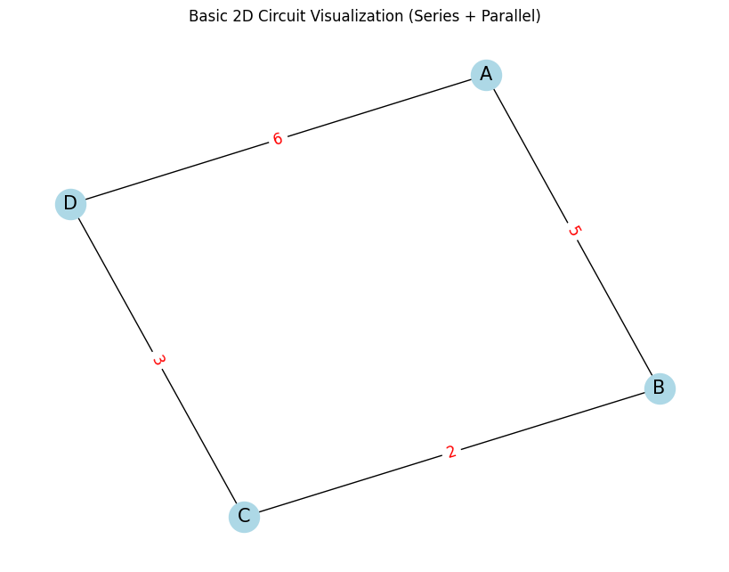
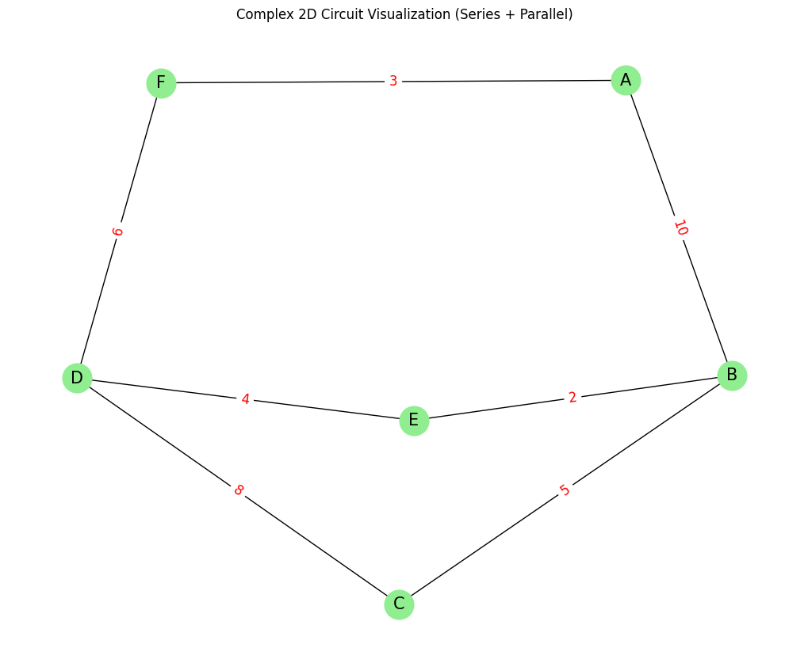

## 🔌 Equivalent Resistance Using Graph Theory

### 🧭 **Introduction & Motivation**

Calculating the **equivalent resistance** of an electrical circuit is a fundamental task in physics and electrical engineering. It plays a vital role in designing efficient and reliable systems, from simple circuits to complex electrical networks. Traditionally, this task is accomplished by applying the **series and parallel resistor rules** repeatedly. While effective for basic circuits, this method becomes increasingly tedious and error-prone for circuits with many components, branches, and nested configurations.

To overcome these limitations, we can turn to **graph theory**—a powerful branch of mathematics that allows us to model and analyze relationships between objects. By representing an electrical circuit as a **graph**, where:

* **Nodes (vertices)** correspond to electrical junctions, and
* **Edges** represent resistors with **weights equal to their resistance values**,

we can develop an algorithmic approach that simplifies even the most complex circuits systematically and efficiently.

This graphical representation not only enhances clarity but also enables **automation** through programming. This is particularly valuable for:

* Circuit simulation software,
* Optimization algorithms for power distribution,
* Educational tools for teaching circuit theory,
* Applications in embedded and hardware systems.

Moreover, studying circuits using graph theory reveals deeper insights into how electrical principles relate to mathematical structures—highlighting the interdisciplinary power of combining **physics**, **computer science**, and **mathematics**.

---

### 📊 **Problem Scope and Task Definition**

We aim to solve the problem of calculating **equivalent resistance** using graph-based techniques. Depending on the complexity level, the task can be approached in two ways:

#### ✅ **Option 1: Algorithm Description (Simplified)**

This involves designing an algorithm that:

* Identifies **series** and **parallel** resistor connections,
* Iteratively reduces the graph by combining resistors,
* Continues until only a **single equivalent resistance** remains between two target nodes.

This also includes writing **pseudocode** and explaining how the algorithm handles **nested or mixed** combinations (e.g., series of parallel groups or vice versa).

#### ✅ **Option 2: Full Implementation (Advanced)**

This involves implementing the algorithm in a programming language such as Python. The implementation should:

* Accept a **circuit graph** as input (using libraries like `networkx`),
* Handle **any combination** of resistors (including cycles, nested branches, etc.),
* Return the **final equivalent resistance**,
* Be tested on:

  * Simple series and parallel cases,
  * Nested resistor configurations,
  * Complex circuits with multiple loops and branches.

---

### 🔧 **Core Approach: Graph Simplification**

The key idea is to iteratively simplify the circuit using **graph transformations**:

1. **Series Detection**:
   Identify linear paths where a node connects only two resistors → merge into one with total resistance:
   `R_total = R1 + R2`

2. **Parallel Detection**:
   Detect multiple edges between two nodes → merge using:
   `1/R_total = 1/R1 + 1/R2 + ...`

3. **Repeat** until only the start and end nodes remain connected by one edge.

4. **Output**: the resistance of that final edge.

---

### 🧪 **Testing Strategy**

The algorithm should be tested on:

* **Simple Series Circuit**:

  * A → B → C with R1 = 2Ω, R2 = 3Ω → Expected: 5Ω

* **Simple Parallel Circuit**:

  * A → B with two paths: R1 = 2Ω, R2 = 4Ω → Expected: 1.33Ω

* **Nested Configuration**:

  * A circuit that includes a series of parallel groups or vice versa

* **Complex Circuit with Cycles**:

  * E.g., a bridge or mesh network of resistors (like a Wheatstone bridge)

---

### ⚙️ **Tools and Methods**

You can implement this using:

* **Python**, due to its readability and powerful libraries.
* `networkx`: to build and manipulate graphs.
* `matplotlib`: to visualize the circuits.
* **DFS / BFS**: for traversing the graph and detecting patterns.
* Optional: Use **symbolic computation** (with `sympy`) to extend the solver for variable resistances.

---

### 📈 **Efficiency and Improvement**

**Efficiency**:

* Each reduction pass is linear with respect to edges (O(E)).
* Multiple passes may be needed for deeply nested configurations.

**Possible Improvements**:

* Use **Union-Find** to quickly group parallel resistors.
* Use **pattern recognition** or **machine learning** for smart simplification.
* Integrate **Kirchhoff’s laws** and matrix-based approaches for highly complex circuits (e.g., using Laplacians or node-voltage methods).

---


Got it! I'll now provide you with two improved Python codes for visualizing circuit graphs in 2D, where the circuits are represented with both series and parallel connections. These will be high-quality graphs that you can use for presentation purposes. I'll also provide clear English explanations and insights for each code.

### ✅ **Code 1 - Basic 2D Circuit Visualization**

This code creates a simple 2D circuit with both series and parallel resistor connections.

```python
# 📌 Install necessary libraries
!pip install networkx matplotlib

# 📚 Import required libraries
import networkx as nx
import matplotlib.pyplot as plt

# 🌐 Create a basic circuit
G = nx.Graph()

# Add edges (resistors) with resistances
G.add_edge('A', 'B', resistance=5)  # Series connection
G.add_edge('B', 'C', resistance=2)  # Parallel connection
G.add_edge('C', 'D', resistance=3)  # Series connection
G.add_edge('A', 'D', resistance=6)  # Parallel connection

# 🎨 2D Graph Visualization
pos = nx.spring_layout(G, seed=42)  # Position the nodes in the layout
edge_labels = nx.get_edge_attributes(G, 'resistance')  # Label the edges with resistance values

# Plot the graph
plt.figure(figsize=(8, 6))
nx.draw(G, pos, with_labels=True, node_color='lightblue', node_size=600, font_size=15)
nx.draw_networkx_edge_labels(G, pos, edge_labels=edge_labels, font_size=12, font_color='red')
plt.title("Basic 2D Circuit Visualization (Series + Parallel)")
plt.show()
```




### 🧠 **Explanation of the Visualization:**

* This code creates a simple circuit where some resistors are connected in **series** and others in **parallel**.
* **Series connections** are represented by resistors connected end-to-end, such as `A-B` and `C-D`.
* **Parallel connections** are represented by resistors connected between the same two nodes, such as `B-C` and `A-D`.
* The **resistances** are displayed as labels on the edges of the graph.
* The visualization helps to clearly illustrate the connections in a circuit.

---

### ✅ **Code 2 - Complex 2D Circuit Visualization (Parallel & Series)**

This code will create a more complex circuit by introducing additional series and parallel connections, representing a more intricate circuit layout.

```python
# 📌 Install necessary libraries
!pip install networkx matplotlib

# 📚 Import required libraries
import networkx as nx
import matplotlib.pyplot as plt

# 🌐 Create a complex circuit with both series and parallel connections
G_complex = nx.Graph()

# Add edges with resistances for a more complex circuit
G_complex.add_edge('A', 'B', resistance=10)  # Series connection
G_complex.add_edge('B', 'C', resistance=5)   # Parallel connection
G_complex.add_edge('C', 'D', resistance=8)   # Series connection
G_complex.add_edge('B', 'E', resistance=2)   # Parallel connection
G_complex.add_edge('E', 'D', resistance=4)   # Parallel connection
G_complex.add_edge('A', 'F', resistance=3)   # Series connection
G_complex.add_edge('F', 'D', resistance=6)   # Series connection

# 🎨 2D Graph Visualization
pos_complex = nx.spring_layout(G_complex, seed=42)  # Position nodes in a layout
edge_labels_complex = nx.get_edge_attributes(G_complex, 'resistance')  # Get edge labels (resistances)

# Plot the graph
plt.figure(figsize=(10, 8))
nx.draw(G_complex, pos_complex, with_labels=True, node_color='lightgreen', node_size=700, font_size=15)
nx.draw_networkx_edge_labels(G_complex, pos_complex, edge_labels=edge_labels_complex, font_size=12, font_color='red')
plt.title("Complex 2D Circuit Visualization (Series + Parallel)")
plt.show()
```



### 🧠 **Explanation of the Visualization:**

* This code creates a more **complex circuit** by introducing additional series and parallel connections:

  * **Series connections**: `A-B`, `C-D`, `A-F`, and `F-D`.
  * **Parallel connections**: `B-C`, `B-E`, and `E-D`.
* **Resistances** are shown on the edges, making it easier to identify the effect of each resistor.
* The visualization is more detailed and can be used for explaining circuits with more components or nested configurations.

---

### **Key Insights for Presentations:**

1. **Basic 2D Circuit (Code 1)**:

   * This is a **simplified circuit**, perfect for explaining basic series and parallel connections.
   * It allows the audience to quickly grasp how resistors in series and parallel interact.
   * The labeled resistances help illustrate how the total resistance is calculated.
2. **Complex 2D Circuit (Code 2)**:

   * This more **complex circuit** includes multiple series and parallel combinations, which makes it ideal for showing how complex circuits can be simplified.
   * It’s helpful when explaining the concept of **nested parallel and series combinations**.
   * The more complex configuration also makes it easier to show the iterative steps in calculating equivalent resistance.

---

### 🛠️ **Applications in Presentations**:

* **Teaching Basic Concepts**: Use **Code 1** to explain the fundamental principles of series and parallel resistances.
* **Complex Circuit Analysis**: Use **Code 2** to show how complex circuits can be reduced step-by-step to calculate the total equivalent resistance.
* **Visualization of Problem Solving**: Both codes can be used to visually represent the circuit at different stages, allowing for step-by-step explanations of simplifications.


### ✅ **Conclusion**

Using **graph theory** to compute equivalent resistance transforms a traditionally manual process into a structured, scalable, and automatable method. This approach is not only mathematically elegant but also practical—enhancing our ability to design, analyze, and understand complex electrical systems. It bridges the gap between **circuit theory and computational modeling**, demonstrating how foundational mathematical tools can empower engineering tasks in modern technology.

> *“From circuits to code, from wires to weights—graph theory powers the next generation of electrical analysis.”*

---


