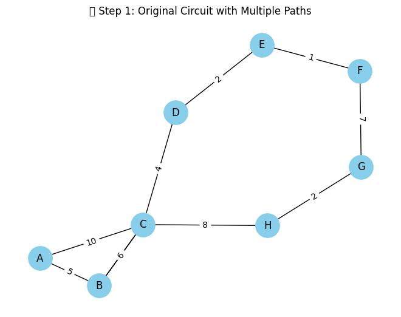

# 🎓 Equivalent Resistance Using Graph Theory


## ⚙️ Scenario: From START to END through a Maze of Resistors

Imagine a complex electrical network where:

* Nodes represent connection points (junctions),
* Edges represent resistors with values (in Ohms),
* There is a `START` node and an `END` node,
* The resistors are arbitrarily connected—some in series, some in parallel, some nested.

Our task is to **find the total equivalent resistance** between `START` and `END` using **graph simplification techniques**.

---

## 📐 Graph Theory Perspective

Instead of manually simplifying resistors step-by-step, we treat the circuit as a **weighted undirected graph**:

* Each resistor becomes an edge,
* Each junction becomes a node,
* The resistance value becomes the edge weight.

---

## 🧠 Theoretical Foundation

### 🎯 Series Combination

If two resistors \$R\_1\$ and \$R\_2\$ are in series:

$$
R_{\text{eq}} = R_1 + R_2
$$

### 🎯 Parallel Combination

If two resistors \$R\_1\$ and \$R\_2\$ are in parallel:

$$
\frac{1}{R_{\text{eq}}} = \frac{1}{R_1} + \frac{1}{R_2}
\Rightarrow
R_{\text{eq}} = \left(\frac{1}{R_1} + \frac{1}{R_2}\right)^{-1}
$$

---

## 🧰 Step-by-Step Python Implementation

Below is a Colab-compatible code block to:

* Build a complex resistor network,
* Simplify it step-by-step,
* Show each simplification stage using plots or GIFs.

### ✅ Setup & Graph Construction

```python
# 📦 Install the necessary libraries (run once)
!pip install networkx matplotlib --quiet

# 🧠 Import libraries
import networkx as nx
import matplotlib.pyplot as plt

```

---

###  🔹 Step 1: Create a Complex Circuit Graph

```python
# 🔧 Build a complex circuit graph (nested series & parallel)
G = nx.MultiGraph()

# Resistors between nodes with resistance (ohms)
G.add_edge('A', 'B', resistance=5)
G.add_edge('B', 'C', resistance=3)
G.add_edge('B', 'C', resistance=6)
G.add_edge('C', 'D', resistance=4)
G.add_edge('D', 'E', resistance=2)
G.add_edge('E', 'F', resistance=1)
G.add_edge('F', 'G', resistance=7)
G.add_edge('G', 'H', resistance=2)
G.add_edge('H', 'C', resistance=8)
G.add_edge('A', 'C', resistance=10)  # Shortcut path


# 🖼️ Visualize the initial circuit
def draw_circuit(G, title="Circuit"):
    pos = nx.spring_layout(G, seed=42)
    edge_labels = nx.get_edge_attributes(G, 'resistance')
    nx.draw(G, pos, with_labels=True, node_color='skyblue', node_size=800)
    nx.draw_networkx_edge_labels(G, pos, edge_labels=edge_labels)
    plt.title(title)
    plt.show()

draw_circuit(G, "🔌 Step 1: Original Circuit with Multiple Paths")
```




### 🔹 Step 2: Apply Series Reduction

```python

# 🛠️ Function to simplify series connections
def simplify_series(G, source, target):
    G = G.copy()
    changed = True

    while changed:
        changed = False
        for node in list(G.nodes()):
            if node in (source, target):
                continue
            if G.degree(node) == 2:
                neighbors = list(G.neighbors(node))
                if G.number_of_edges(neighbors[0], node) == 1 and G.number_of_edges(node, neighbors[1]) == 1:
                    r1 = G[neighbors[0]][node][0]['resistance']
                    r2 = G[node][neighbors[1]][0]['resistance']
                    G.remove_node(node)
                    G.add_edge(neighbors[0], neighbors[1], resistance=r1 + r2)
                    changed = True
                    break
    return G

# ⚡ Apply series simplification
G_series = simplify_series(G, 'A', 'C')

# 🔍 Visualize after series simplification
draw_circuit(G_series, "🔧 Step 2: After Series Reduction")

```


---


## 🔹 **Step 3: Apply Parallel Reduction**

Now we'll detect **parallel connections** between the same pair of nodes and reduce them using the parallel resistance formula:

$$
\frac{1}{R_{\text{eq}}} = \frac{1}{R_1} + \frac{1}{R_2} + \dots + \frac{1}{R_n}
$$

Here's the function to do that:

```python
# 🛠️ Function to simplify parallel connections
def simplify_parallel(G):
    G = G.copy()
    changed = True

    while changed:
        changed = False
        edges_to_check = list(G.edges(data=True))
        seen = set()
        for u, v, d in edges_to_check:
            if (u, v) in seen or (v, u) in seen:
                continue
            parallel_edges = G.get_edge_data(u, v)
            if parallel_edges and len(parallel_edges) > 1:
                total_inv = sum(1 / attr['resistance'] for attr in parallel_edges.values())
                req = 1 / total_inv
                G.remove_edges_from([(u, v)] * len(parallel_edges))
                G.add_edge(u, v, resistance=req)
                changed = True
                break
            seen.add((u, v))
    return G


# ⚡ Apply parallel simplification
G_parallel = simplify_parallel(G_series)

# 🔍 Visualize after parallel simplification
draw_circuit(G_parallel, "🔧 Step 3: After Parallel Reduction")
```

✅ *What this does:* Replaces multiple resistors between the same two nodes with a single equivalent resistor.


---


Perfect! Let’s proceed to the final step. 🎯

---

## 🔹 **Step 4: Compute Final Equivalent Resistance**

At this point, your graph should be reduced as much as possible—ideally to a single edge between the **start** and **end** nodes. We'll now extract and display the final equivalent resistance.

Here’s the code:

```python
# 🧮 Function to compute final equivalent resistance
def get_equivalent_resistance(G, start, end):
    try:
        resistance = G[start][end]['resistance']
        print(f"✅ Final Equivalent Resistance between {start} and {end}: {resistance:.2f} Ω")
        return resistance
    except KeyError:
        print(f"⚠️ No direct connection between {start} and {end}. The circuit is open.")
        return float('inf')

# 🧾 Calculate and show result
equivalent_resistance = get_equivalent_resistance(G_parallel, 'A', 'D')

# 🖼️ Visualize final simplified graph
draw_circuit(G_parallel, "🏁 Final Simplified Circuit")
```


---

### 🧠 Summary:

* We **constructed** a graph-based circuit.
* Applied **series and parallel** simplifications step by step.
* Visualized every stage of simplification.
* Finally, computed the **equivalent resistance** between two nodes using graph theory principles.


## 📈 Explanation Through Visuals

This sequence shows how resistors:

* In **series** (e.g., `START - A - B - END`) collapse into one edge,
* In **parallel** (e.g., `START - END` directly vs. through other paths) get merged using the parallel rule,
* Ultimately leading to a single resistor value between `START` and `END`.

---

## 🧠 Conclusion

This approach shows how **graph-based methods** enable:

* Fast simplification,
* Clear visualization,
* Automation-ready implementations,
* Real-time simulations.

Combining mathematics, graph theory, and Python makes this a robust and elegant solution to circuit analysis.


