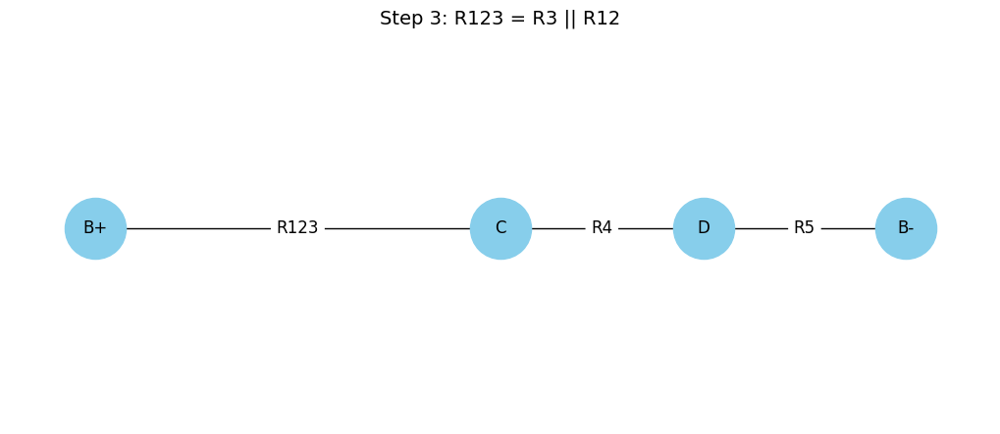

## 🎓 **Slide 1: Title Slide**

* **Title**: **Equivalent Resistance Using Graph Theory**
* **Subtitle**: *A Systematic Approach to Simplifying Complex Circuits*


📽 *Animation Suggestion*: Fade-in for title and subtitle, with a background image of a complex circuit.

---

## 💡 **Slide 2: Motivation**

### **Why Use Graph Theory for Equivalent Resistance?**

* Traditional series/parallel rules become messy in complex circuits.
* Graph theory offers a structured, algorithmic approach.
* Powerful for:

  * Circuit simulation tools
  * Optimization engines
  * Educational purposes

📈 *Visual*: Show a tangled resistor network vs. a neat graph.

---

## 🔗 **Slide 3: Key Concept — Circuits as Graphs**

### **Graph Representation:**

* **Nodes** → Junctions
* **Edges** → Resistors (weights = resistance)

🖼️ *Visual Aid*: Circuit diagram on the left, graph on the right (linked by arrows).

🧠 *Analogy*: Think of it like a road network with travel cost = resistance.

---

## ⚙️ **Slide 4: Algorithm Overview**

### **Step-by-Step Plan**

```python
function compute_equivalent_resistance(graph, source, sink):
    while number_of_edges(graph) > 1:
        detect all series pairs
        if any found:
            replace each series pair with an equivalent resistor
        else:
            detect all parallel pairs
            replace each parallel pair with an equivalent resistor
    return resistance between source and sink
```

🧭 *Goal*: Reduce the graph to a single edge between source and sink.

---

## 🧪 **Slide 5: Case Study Introduction**

### **We’ll Walk Through an Example Circuit**

* Circuit with resistors: $R_1, R_2, R_3, R_4, R_5$
* **Source**: $B+$, **Sink**: $B-$

🖼️ *Visual*: Realistic resistor diagram with labels.

---

## 📊 **Slide 6: Graph Representation**

### **Graph Version of the Circuit**

* **Nodes**: $B+, n_1, n_2, n_3, n_4, B-$
* **Edges**: Represent resistors with weights

👁️ *Visual*: `networkx`-based graph visualization

---

## 🧑‍💻 **Slide 7: Python Code — Graph Creation**

### **Initial Circuit Graph with `networkx`**

```python
import matplotlib.pyplot as plt
import networkx as nx

# Başlangıç devresi: karmaşık devre
G_step1 = nx.Graph()
G_step1.add_edge("B+", "A", label="R1")
G_step1.add_edge("A", "C", label="R2")
G_step1.add_edge("B+", "B", label="R3")
G_step1.add_edge("B", "C", label="")
G_step1.add_edge("C", "D", label="R4")
G_step1.add_edge("D", "B-", label="R5")

pos1 = {
    "B+": (0, 2),
    "A": (1, 2.5),
    "C": (2, 2),
    "B": (1, 1.2),
    "D": (3, 2),
    "B-": (4, 2)
}

plt.figure(figsize=(10, 4))
nx.draw(G_step1, pos1, with_labels=True, node_color="lightyellow", node_size=2000, font_size=12)
edge_labels1 = {(u, v): d['label'] for u, v, d in G_step1.edges(data=True) if d['label']}
nx.draw_networkx_edge_labels(G_step1, pos1, edge_labels=edge_labels1, font_size=12)
plt.title("Step 1: Original Circuit", fontsize=14)
plt.axis("off")
plt.show()
```

📸 *Output*: Rendered interactive graph image.

---

## 🔄 **Slide 8: Step 1 — Series Reduction**

### **Detect and Replace Series Resistors**

* Example: $R_2$ and $R_3$ in series → $R_{23} = R_2 + R_3$

🛠️ *Visual*: Before/after graph with series highlighted.

---

## 🧑‍💻 **Slide 9: Python Code — Series Detection (R1 & R2 Series → R12)**

```python
G_step2 = nx.Graph()
G_step2.add_edge("B+", "C", label="R12")  # R1 + R2
G_step2.add_edge("B+", "B", label="R3")
G_step2.add_edge("B", "C", label="")
G_step2.add_edge("C", "D", label="R4")
G_step2.add_edge("D", "B-", label="R5")

plt.figure(figsize=(10, 4))
nx.draw(G_step2, pos1, with_labels=True, node_color="lightgreen", node_size=2000, font_size=12)
edge_labels2 = {(u, v): d['label'] for u, v, d in G_step2.edges(data=True) if d['label']}
nx.draw_networkx_edge_labels(G_step2, pos1, edge_labels=edge_labels2, font_size=12)
plt.title("Step 2: R1 and R2 Combined (R12)", fontsize=14)
plt.axis("off")
plt.show()

```


🎬 *Action*: Highlight which node gets removed in visualization.

---

## 🧲 **Slide 10: Step 2 — Parallel Reduction**

### **Detect and Replace Parallel Resistors**

* Formula: $R_{eq} = \frac{R_1 \cdot R_2}{R_1 + R_2}$

🔁 *Visual*: Two edges between same nodes → one edge

---

## 🧑‍💻 **Slide 11: Python Code — Parallel Detection  (R12 & R3 Parallel → R123) **

```python
G_step3 = nx.Graph()
G_step3.add_edge("B+", "C", label="R123")  # R12 || R3
G_step3.add_edge("C", "D", label="R4")
G_step3.add_edge("D", "B-", label="R5")

plt.figure(figsize=(10, 4))
nx.draw(G_step3, pos1, with_labels=True, node_color="skyblue", node_size=2000, font_size=12)
edge_labels3 = {(u, v): d['label'] for u, v, d in G_step3.edges(data=True) if d['label']}
nx.draw_networkx_edge_labels(G_step3, pos1, edge_labels=edge_labels3, font_size=12)
plt.title("Step 3: R123 = R3 || R12", fontsize=14)
plt.axis("off")
plt.show()

```

📌 *Tip*: Use multigraphs for actual multiple edges, or simulate via attributes.

---


## 🧑‍💻 **Slide 11.5: Python Code — Series Detection (R123 & R4 Series → R1234) **
```python
G_step4 = nx.Graph()
G_step4.add_edge("B+", "D", label="R1234")  # R123 + R4
G_step4.add_edge("D", "B-", label="R5")

pos4 = {
    "B+": (0, 2),
    "D": (2, 2),
    "B-": (4, 2)
}

plt.figure(figsize=(8, 3))
nx.draw(G_step4, pos4, with_labels=True, node_color="orange", node_size=2000, font_size=12)
edge_labels4 = {(u, v): d['label'] for u, v, d in G_step4.edges(data=True)}
nx.draw_networkx_edge_labels(G_step4, pos4, edge_labels=edge_labels4, font_size=12)
plt.title("Step 4: R123 + R4 = R1234", fontsize=14)
plt.axis("off")
plt.show()
```


## ✅ **Slide 12: Final Reduction**

### **When Only One Edge Remains**

* Only edge between $B+$ and $B-$
* This edge's weight = total equivalent resistance

🧠 *Key Insight*: Reduction is recursive and deterministic.

---

## 🧩 **Slide 13:  Final Solution (R1234 & R5 Serial → R_eq)**

```python
G_step5 = nx.Graph()
G_step5.add_edge("B+", "B-", label="R_eq")  # Final result

pos5 = {
    "B+": (0, 1),
    "B-": (4, 1)
}

plt.figure(figsize=(6, 2))
nx.draw(G_step5, pos5, with_labels=True, node_color="salmon", node_size=2000, font_size=12)
edge_labels5 = {(u, v): d['label'] for u, v, d in G_step5.edges(data=True)}
nx.draw_networkx_edge_labels(G_step5, pos5, edge_labels=edge_labels5, font_size=12)
plt.title("Step 5: Final Equivalent Resistance (R_eq)", fontsize=14)
plt.axis("off")
plt.show()

```


---

## 🔁 **Slide 14: More Complex Cases**

### **Loops, Bridges, and Combinations**

* Can handle:

  * Nested branches
  * Multi-path topologies
* Fully systematic!

🧠 *Analogy*: Like simplifying a maze using rules.

---

## ⏱️ **Slide 15: Efficiency & Optimization**

### **Performance & Scaling**

* Time complexity: Up to $O(n^2)$
* Optimizations:

  * Priority queues for bottlenecks
  * Memoization for subgraphs
  * Use of `networkx.MultiGraph` for true parallel edges

⚙️ *Advanced Tip*: Integrate with SPICE or circuit solver engines.

---

## 🧠 **Slide 16: Conclusion**

### **Key Takeaways**

* Graph theory enables systematic, programmable simplification.
* Great for teaching, software, and automation.
* Bridges physics with computation.

💬 *Quote*:

> "By treating circuits as graphs, we turn intuition into algorithms."

---

## 📚 **Slide 17: References & Acknowledgments**

* **Resources**:

  * *Introduction to Graph Theory* by Douglas West
  * *The Art of Electronics* by Horowitz & Hill
  * `networkx` and `matplotlib` documentation
* **Thanks**:

  * Collaborators, mentors, and open-source libraries

---

### 🔚 Final Notes

* **Visual Polish**:

  * Use color coding: red for series, blue for parallel.
  * Animate graph reductions slide-by-slide.
* **Interactive Ideas**:

  * Add sliders to change resistance values
  * Live demo with Jupyter Notebook

---

