# 🎓 **Presentation: Exploring the Central Limit Theorem through Simulations**


## 🪄 Slide 1: Title Slide

**Title:**
📊 *Exploring the Central Limit Theorem through Simulations*

**Subtitle:**
*How sample means tend toward normality—no matter the original distribution.*

---

## 🔍 Slide 2: What is the Central Limit Theorem?

> **Definition:**
> The Central Limit Theorem (CLT) states that the sampling distribution of the sample mean tends toward a normal distribution as the sample size increases, **regardless of the population's original distribution**.

📌 Why is it important?

* Allows inference using normal distribution.
* Foundation for confidence intervals and hypothesis testing.
* Powers much of modern statistics.

---

## 🛠 Slide 3: Simulation Plan

**What will we do?**

1. Generate populations from various distributions:

   * Uniform
   * Exponential
   * Binomial
2. Draw many random samples of sizes: 5, 10, 30, 50
3. Compute sample means
4. Visualize the sampling distribution
5. Discuss how normality emerges as sample size grows

---

## 🐍 Slide 4: Python Setup (Code Block)

```python
import numpy as np
import matplotlib.pyplot as plt
import seaborn as sns

sns.set(style='whitegrid')
```

💡 *We use NumPy for data generation and Seaborn for visualization.*

---

## 🧪 Slide 5: Sampling Function (Code Block)

```python
def simulate_sampling_distribution(population_data, sample_sizes, num_samples=1000):
    results = {}
    for size in sample_sizes:
        sample_means = []
        for _ in range(num_samples):
            sample = np.random.choice(population_data, size=size)
            sample_means.append(np.mean(sample))
        results[size] = sample_means
    return results
```

> **Definition:**
> *Sampling Distribution:* The distribution of means across repeated samples from the same population.

---

## 🔵 Slide 6: Uniform Distribution – Simulations

```python
uniform_population = np.random.uniform(low=0, high=100, size=100000)
sample_sizes = [5, 10, 30, 50]
uniform_results = simulate_sampling_distribution(uniform_population, sample_sizes)
```

📘 **Uniform Distribution:**
All values are equally likely.

---

## 📊 Slide 7: Uniform Distribution – Plots

Loop to generate histograms:

```python
for size, means in uniform_results.items():
    plt.figure(figsize=(8,4))
    sns.histplot(means, bins=30, kde=True, color='skyblue')
    plt.title(f'Uniform Distribution - Sample Size = {size}')
    plt.xlabel('Sample Mean')
    plt.ylabel('Frequency')
    plt.show()
```
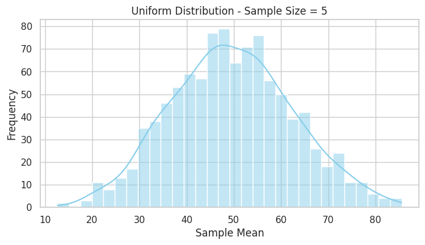
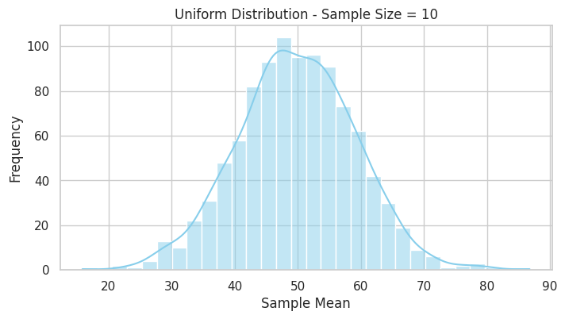
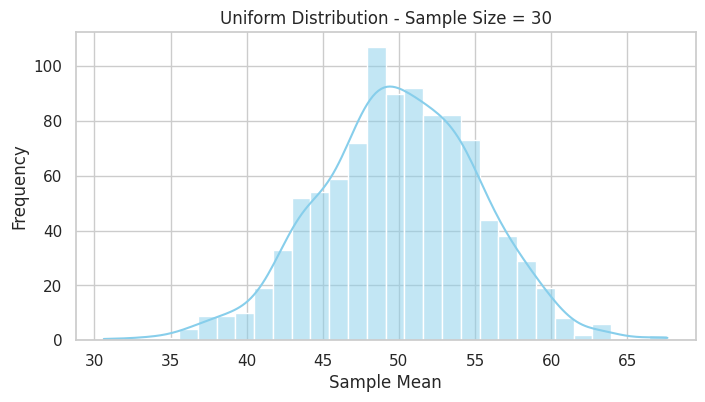
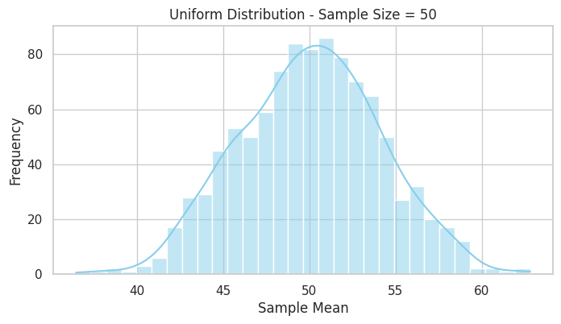


**Observation:** As sample size increases, the sampling distribution becomes more normal.

---

## 🔶 Slide 8: Exponential Distribution – Simulations

```python
exponential_population = np.random.exponential(scale=1.0, size=100000)
exponential_results = simulate_sampling_distribution(exponential_population, sample_sizes)
```

📘 **Exponential Distribution:**
A right-skewed distribution, often used to model time between events.

---

## 📊 Slide 9: Exponential Distribution – Plots

```python
for size, means in exponential_results.items():
    plt.figure(figsize=(8,4))
    sns.histplot(means, bins=30, kde=True, color='orange')
    plt.title(f'Exponential Distribution - Sample Size = {size}')
    plt.xlabel('Sample Mean')
    plt.ylabel('Frequency')
    plt.show()
```

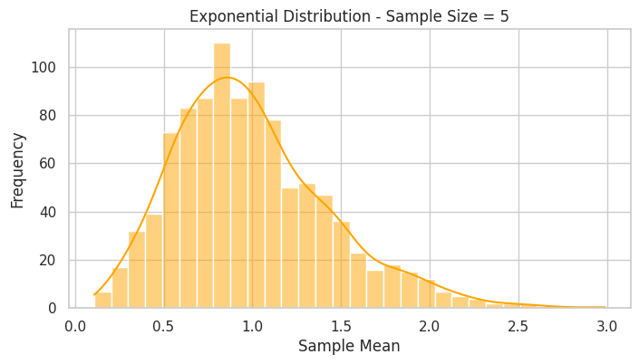
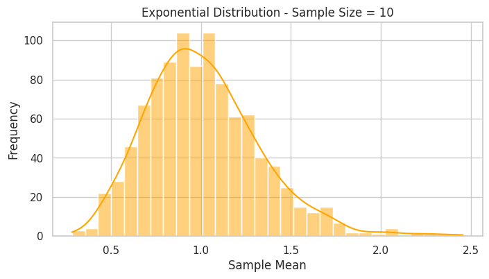
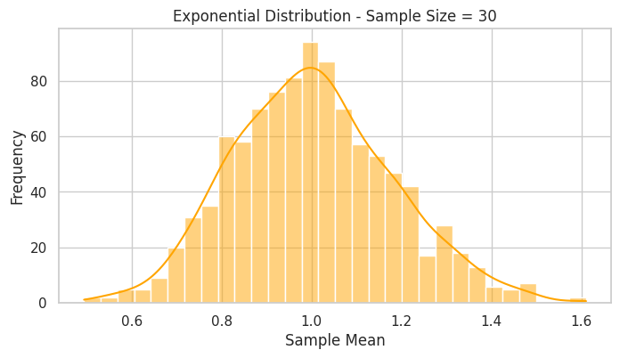
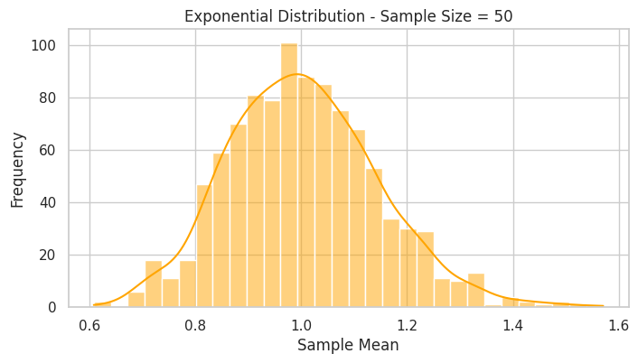
**Observation:** Skewed population, but sample means tend toward normality with larger sample size.

---

## 🟥 Slide 10: Binomial Distribution – Simulations

```python
binomial_population = np.random.binomial(n=1, p=0.3, size=100000)
binomial_results = simulate_sampling_distribution(binomial_population, sample_sizes)
```

📘 **Binomial Distribution:**
Discrete distribution showing number of successes in fixed trials with probability *p*.

---

## 📊 Slide 11: Binomial Distribution – Plots

```python
for size, means in binomial_results.items():
    plt.figure(figsize=(8,4))
    sns.histplot(means, bins=30, kde=True, color='red')
    plt.title(f'Binomial Distribution - Sample Size = {size}')
    plt.xlabel('Sample Mean')
    plt.ylabel('Frequency')
    plt.show()
```
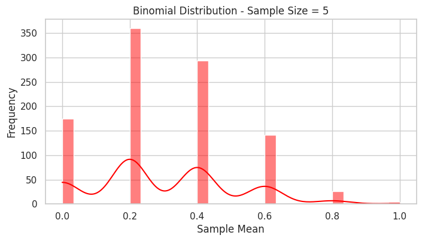

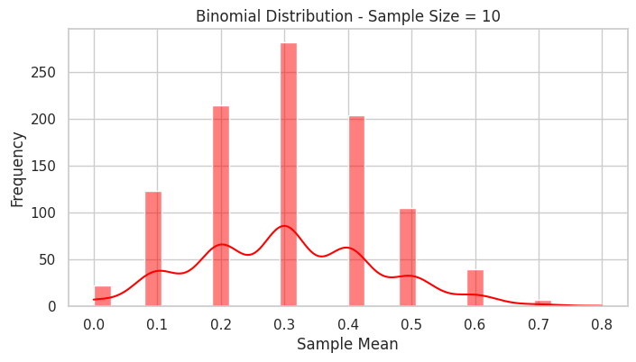

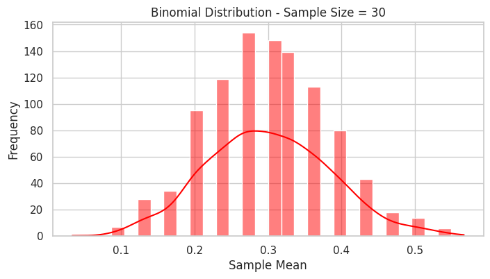

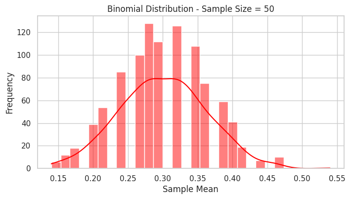
**Observation:** Even discrete distributions follow CLT.

---

## 📉 Slide 12: Variance of Sample Means

```python
pop_var = np.var(uniform_population)
sizes = np.arange(1, 101)
variances = [pop_var / n for n in sizes]

plt.figure(figsize=(8,5))
plt.plot(sizes, variances, label='Var(X̄) = σ²/n', color='green')
plt.xlabel('Sample Size')
plt.ylabel('Variance of Sample Mean')
plt.title('Decrease in Variance of Sample Mean with Increasing n')
plt.legend()
plt.show()
```

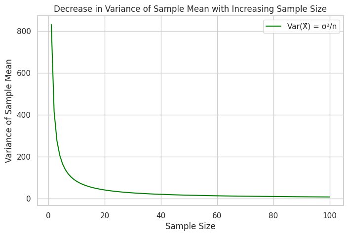

📘 **Key Formula:**

$$
\text{Var}(\bar{X}) = \frac{\sigma^2}{n}
$$

---

## 🌎 Slide 13: Real-World Applications

**Where is CLT used?**

* 📦 Quality control in manufacturing (Six Sigma)
* 💰 Financial modeling and risk management
* 🧪 Medical trials and drug testing
* 📊 A/B testing in web analytics
* 📈 Estimating population means in surveys

---

## 💬 Slide 14: Conclusion

* CLT explains why the **normal distribution appears everywhere**
* Works regardless of population distribution (with large enough samples)
* Simulations help visualize and internalize this key idea


