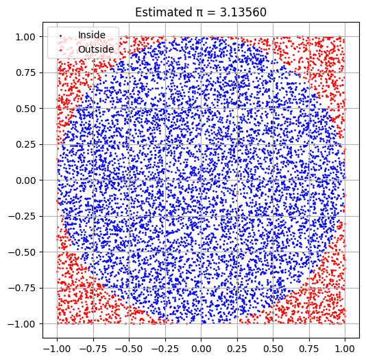
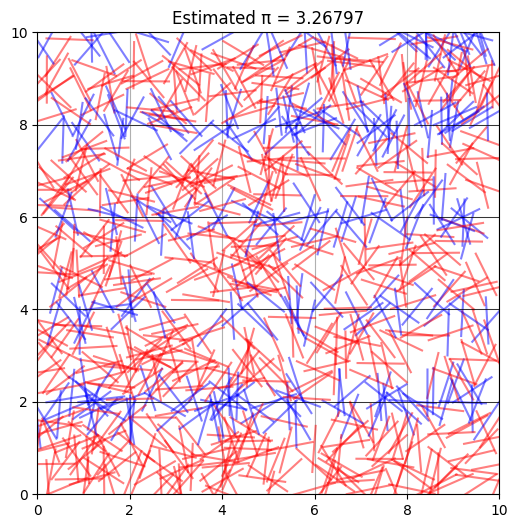
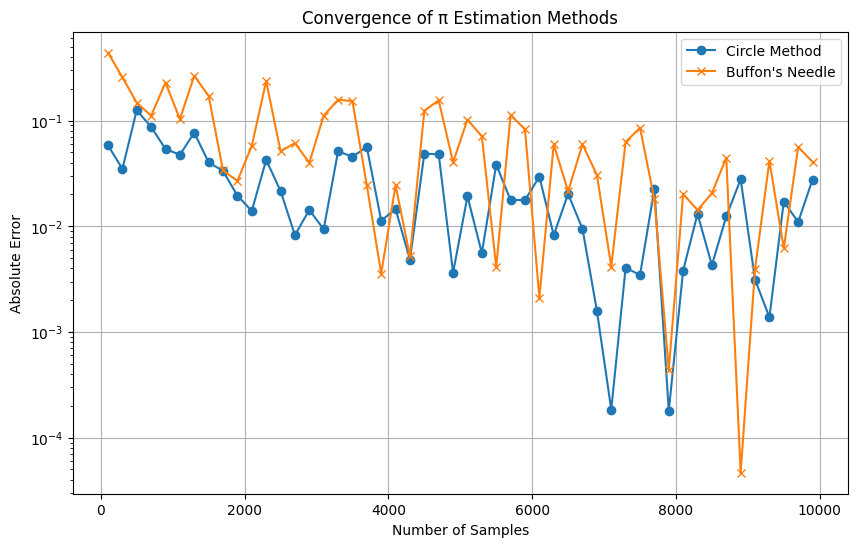

---

# 🎯 Slide 1: **Title**

### **Estimating π Using Monte Carlo Methods**

#### A Visual and Statistical Exploration


# 💡 Slide 2: **Motivation**

* Monte Carlo methods use **random sampling** to solve mathematical problems.
* Estimating **π** is a classic, elegant example of applying randomness in:

  * Geometry
  * Probability
  * Numerical computation
* Helps understand convergence and simulation accuracy.

---

# 📋 Slide 3: **Agenda**

1. Estimating π using a **Unit Circle**
2. Estimating π using **Buffon’s Needle**
3. **Python code** demonstrations
4. **Visual outputs** for clarity
5. **Convergence analysis**
6. Final comparison and conclusion

---

# 🔵 Slide 4: **Part 1 — Estimating π via Circle**

## 🧠 Theoretical Foundation

* Consider a square of side 2 and a circle of radius 1 inside.
* Circle area = π × 1² = π
* Square area = 2² = 4
* Random points uniformly placed → proportion in circle ≈ π / 4

$$
\pi \approx 4 \times \frac{\text{Points Inside Circle}}{\text{Total Points}}
$$

---

# 🧪 Slide 5: **Python Simulation — Circle Method**

```python
import numpy as np
import matplotlib.pyplot as plt

def estimate_pi_circle(n_points=10000, visualize=True):
    x = np.random.uniform(-1, 1, n_points)
    y = np.random.uniform(-1, 1, n_points)
    distances = x**2 + y**2
    inside = distances <= 1

    pi_estimate = 4 * np.sum(inside) / n_points

    if visualize:
        plt.figure(figsize=(6, 6))
        plt.scatter(x[inside], y[inside], s=1, color='blue', label='Inside Circle')
        plt.scatter(x[~inside], y[~inside], s=1, color='red', label='Outside Circle')
        circle = plt.Circle((0, 0), 1, color='black', fill=False)
        plt.gca().add_patch(circle)
        plt.gca().set_aspect('equal')
        plt.title(f"Estimated π = {pi_estimate:.5f}")
        plt.legend()
        plt.grid(True)
        plt.show()

    return pi_estimate
```

---

# 📊 Slide 6: **Circle Visualization**

### What You'll See:

* **Blue points**: Inside the circle
* **Red points**: Outside the circle
* Real-time estimate appears on the plot title
  ✅ Easy to understand visually

---

# 📈 Slide 7: **Convergence of Circle Method**

* Accuracy improves with more points
* **Error \~ 1 / √N** → slow but consistent convergence
* After \~10,000 points, π is usually accurate to 2–3 decimal places

✅ Very stable method

---

# 📍 Slide 8: **Part 2 — Estimating π via Buffon’s Needle**

## 🧠 Theoretical Foundation

* Drop a needle of length **L** on a plane with **parallel lines** d units apart.
* Probability of crossing a line:

$$
P = \frac{2L}{d\pi} \Rightarrow \pi \approx \frac{2L \cdot N}{d \cdot C}
$$

Where:

* **N** = total number of drops
* **C** = number of crosses

---

# 🧪 Slide 9: **Python Simulation — Buffon’s Needle**

```python
import numpy as np
import matplotlib.pyplot as plt

def buffons_needle(n_drops=1000, needle_length=1.0, line_spacing=2.0, visualize=True):
    # Random positions
    x_centers = np.random.uniform(0, line_spacing / 2, n_drops)
    angles = np.random.uniform(0, np.pi / 2, n_drops)

    # Calculate whether each needle crosses a line
    crosses = x_centers <= (needle_length / 2) * np.sin(angles)
    num_crosses = np.sum(crosses)

    # Estimate pi
    if num_crosses == 0:
        pi_estimate = np.inf
    else:
        pi_estimate = (2 * needle_length * n_drops) / (line_spacing * num_crosses)

    if visualize:
        plt.figure(figsize=(6, 6))
        for i in range(n_drops):
            x = np.random.uniform(0, 10)
            y = np.random.uniform(0, 10)
            angle = np.random.uniform(0, np.pi)
            x0 = x - (needle_length / 2) * np.cos(angle)
            y0 = y - (needle_length / 2) * np.sin(angle)
            x1 = x + (needle_length / 2) * np.cos(angle)
            y1 = y + (needle_length / 2) * np.sin(angle)
            color = 'blue' if (int(y0 / line_spacing) != int(y1 / line_spacing)) else 'red'
            plt.plot([x0, x1], [y0, y1], color=color, alpha=0.5)

        for i in range(0, 11):
            plt.axhline(i * line_spacing, color='black', linewidth=0.5)

        plt.title(f"Estimated π = {pi_estimate:.5f}")
        plt.xlim(0, 10)
        plt.ylim(0, 10)
        plt.gca().set_aspect('equal')
        plt.grid(True)
        plt.show()

    return pi_estimate

# Run the function to test
buffons_needle(n_drops=1000, visualize=True)

```

---

# 📷 Slide 10: **Needle Visualization**

* **Blue needles**: Crossed a line
* **Red needles**: Did not cross
* Elegant and geometric simulation
  👁️ Visually distinct from the circle method

---

# 📈 Slide 11: **Combined Convergence Plot**

### Code: Comparing Both Methods

```python
import numpy as np
import matplotlib.pyplot as plt

def estimate_pi_circle_only(n_points):
    x = np.random.uniform(-1, 1, n_points)
    y = np.random.uniform(-1, 1, n_points)
    inside = x**2 + y**2 <= 1
    return 4 * np.sum(inside) / n_points

def estimate_pi_buffon_only(n_drops, needle_length=1.0, line_spacing=2.0):
    x_centers = np.random.uniform(0, line_spacing / 2, n_drops)
    angles = np.random.uniform(0, np.pi / 2, n_drops)
    crosses = x_centers <= (needle_length / 2) * np.sin(angles)
    num_crosses = np.sum(crosses)
    if num_crosses == 0:
        return np.nan
    return (2 * needle_length * n_drops) / (line_spacing * num_crosses)

# Sample sizes
samples = np.arange(100, 10001, 200)
pi_true = np.pi
circle_errors = []
buffon_errors = []

for n in samples:
    pi_circle = estimate_pi_circle_only(n)
    pi_buffon = estimate_pi_buffon_only(n)
    circle_errors.append(abs(pi_circle - pi_true))
    buffon_errors.append(abs(pi_buffon - pi_true))

# Plotting convergence
plt.figure(figsize=(10, 6))
plt.plot(samples, circle_errors, label="Circle Method", marker='o')
plt.plot(samples, buffon_errors, label="Buffon's Needle", marker='x')
plt.xlabel("Number of Samples")
plt.ylabel("Absolute Error")
plt.title("Convergence of π Estimation Methods")
plt.legend()
plt.grid(True)
plt.yscale("log")  # Optional: log scale to highlight convergence speed
plt.show()
```

---

# ⏱️ Slide 11.5: **Convergence Analysis**

### How Fast Do We Get a Good Estimate?

* **Circle method**: Fast convergence

  * Good estimate after \~5,000–10,000 points
* **Buffon’s needle**: Slower convergence

  * Higher variance in results
  * More samples needed to stabilize

### Rule of Thumb:

$$
\text{Error} \propto \frac{1}{\sqrt{N}} \quad \text{(for both methods)}
$$

---

# 📊 Slide 12: **Comparison Table**

| Feature            | Circle Method | Buffon’s Needle    |
| ------------------ | ------------- | ------------------ |
| Convergence Speed  | ✅ Faster      | ❌ Slower           |
| Visual Intuition   | ✅ High        | ✅ Moderate         |
| Variance           | ❌ Low         | ⚠️ High            |
| Complexity         | ✅ Simple Math | ⚠️ Trig + Geometry |
| Accuracy (typical) | ✅ Stable      | ⚠️ Varies heavily  |

---

# ✅ Slide 13: **Conclusion**

* Monte Carlo methods demonstrate **randomness in precision**
* **Circle-based method** is:

  * More accurate
  * Easier to simulate
* **Buffon’s Needle**:

  * Elegant and historic
  * Good example of geometry in probability
* **Convergence matters** in method choice

---

# 📁 Slide 14: **Deliverables**

### 💻 Code:

* Python functions for both methods
* Visualization & convergence graph

### 📄 Report Includes:

* Explanations
* Derivations
* Full annotated code

### 📊 Outputs:

* Scatter plots & needle visuals
* Convergence graphs


