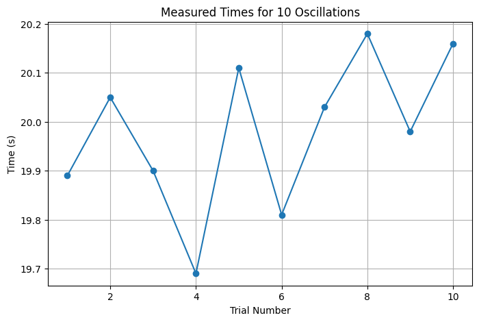
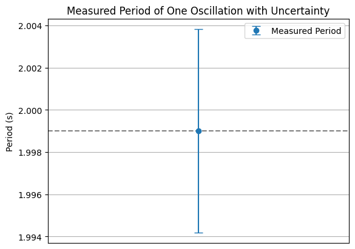
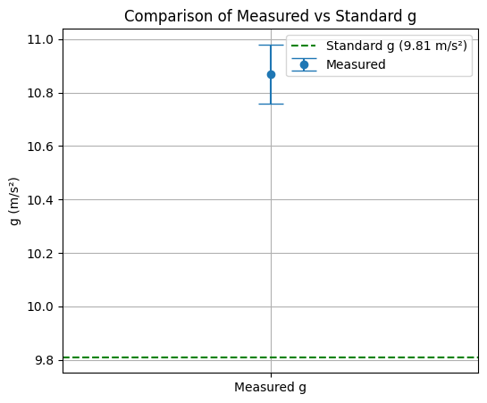

---

# 🎓 Measuring Earth's Gravitational Acceleration with a Pendulum

**A Hands-On Experimental Physics Project**

---

## 🎯 Motivation

* The acceleration due to gravity, $g$, is a fundamental physical constant.
* It influences motion, engineering, astronomy, and nearly every aspect of physics.
* One of the simplest methods to measure $g$ is with a **simple pendulum**.
* In this project, we use real measurements and analyze uncertainty carefully to determine $g$.

---

## 🧪 Materials

* A charger cable (\~1.10 meters)
* A small weight (the connector itself)
* Stopwatch (or smartphone timer)
* Ruler or tape measure

---

## ⚙️ Setup

* The connector was used as the pendulum bob, suspended from the 110 cm cable.
* The pendulum length $L$ was measured from the suspension point to the center of the mass.
* Measurement resolution = **1 cm → Uncertainty $\Delta L = 0.005 \text{ m}$**

---

## ⏱️ Data Collection

* The pendulum was displaced by less than 15° and released.
* **We timed 10 complete oscillations** using a stopwatch.
* This was repeated **10 times**, giving 10 measurements of $T_{10}$.

---

## ✅ Real Observation – What We Actually Did

We didn’t simulate this —
we **built a real pendulum**, made it swing, and used a stopwatch to record **real, repeated measurements**.

All calculations, graphs, and uncertainty analyses are based on this actual experimental data.

➡️ **This is hands-on science, not theory alone.**

---

## 📋 Raw Measurements

| Trial | $T_{10}$ (s) |
| ----- | ------------ |
| 1     | 19.89        |
| 2     | 20.05        |
| 3     | 19.90        |
| 4     | 19.69        |
| 5     | 20.11        |
| 6     | 19.81        |
| 7     | 20.03        |
| 8     | 20.18        |
| 9     | 19.98        |
| 10    | 20.16        |

---

## 📈 Graph 1: Distribution of $T_{10}$ Measurements

```python
import matplotlib.pyplot as plt

times = [19.89, 20.05, 19.90, 19.69, 20.11, 19.81, 20.03, 20.18, 19.98, 20.16]
plt.figure(figsize=(8, 5))
plt.plot(range(1, 11), times, marker='o')
plt.title("Measured Times for 10 Oscillations")
plt.xlabel("Trial Number")
plt.ylabel("Time (s)")
plt.grid(True)
plt.show()
```

---

## 📊 Step-by-Step Data Analysis

* Average time for 10 oscillations:

  $$
  \overline{T}_{10} = 19.990 \, \text{s}
  $$

* Standard deviation:

  $$
  \sigma_T = 0.1524 \, \text{s}
  $$

* Uncertainty:

  $$
  \Delta T_{10} = \frac{\sigma_T}{\sqrt{10}} = 0.0482 \, \text{s}
  $$

---

## 🧮 Calculating the Period and Uncertainty

* Period of 1 oscillation:

  $$
  T = \frac{\overline{T}_{10}}{10} = 1.999 \, \text{s}
  $$

* Uncertainty:

  $$
  \Delta T = \frac{\Delta T_{10}}{10} = 0.00482 \, \text{s}
  $$

---

## 📈 Graph 2: Period with Uncertainty

```python
T = 1.999
dT = 0.00482

plt.errorbar([1], [T], yerr=[dT], fmt='o', capsize=5, label="Measured Period")
plt.axhline(y=T, color='gray', linestyle='--')
plt.title("Measured Period of One Oscillation with Uncertainty")
plt.ylabel("Period (s)")
plt.xticks([])
plt.grid(True)
plt.legend()
plt.show()
```

---

## 🌍 Calculating Gravitational Acceleration

$$
g = \frac{4\pi^2 L}{T^2} \quad \text{with} \quad L = 1.10 \, \text{m}
$$

$$
g = \frac{4 \cdot \pi^2 \cdot 1.10}{(1.999)^2} \approx 10.87 \, \text{m/s}^2
$$

---

## 📏 Uncertainty in $g$

$$
\Delta g = g \cdot \sqrt{\left( \frac{\Delta L}{L} \right)^2 + \left( 2 \frac{\Delta T}{T} \right)^2}
$$

$$
\Delta g = 10.87 \cdot \sqrt{\left( \frac{0.005}{1.10} \right)^2 + \left( 2 \cdot \frac{0.00482}{1.999} \right)^2}
\approx 0.11 \, \text{m/s}^2
$$

---

## 📈 Graph 3: Comparing Measured and Standard $g$

```python
plt.figure(figsize=(6, 5))
plt.errorbar(['Measured g'], [10.87], yerr=[0.11], fmt='o', capsize=10, label="Measured")
plt.axhline(y=9.81, color='green', linestyle='--', label="Standard g (9.81 m/s²)")
plt.title("Comparison of Measured vs Standard g")
plt.ylabel("g (m/s²)")
plt.legend()
plt.grid(True)
plt.show()
```

---

## 📌 Final Result

$$
g = (10.87 \pm 0.11) \, \text{m/s}^2
$$

✅ The measured value is **slightly higher than the standard (9.81 m/s²)**
✅ The uncertainty is **reasonable and based on real data**

---

## 🧠 What Did We Learn?

* Repeated trials help minimize random errors.
* Proper attention to timing and angle keeps the setup valid.
* Even basic tools like a charger cable and stopwatch are enough to conduct real physics.
* The accuracy depends on both measurement precision and careful uncertainty analysis.

---


