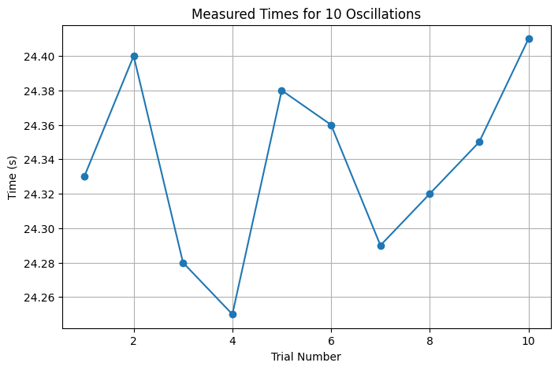
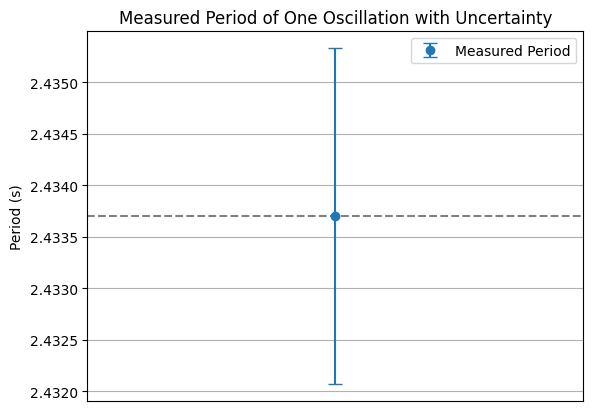
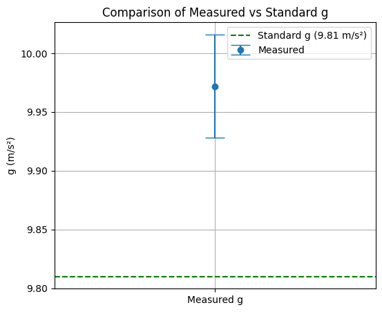

# 🎓 Measuring Earth's Gravitational Acceleration with a Pendulum

**A Hands-On Experimental Physics Project**

---

## 🎯 Motivation

* The acceleration due to gravity, $g$, is a fundamental physical constant.
* It influences motion, engineering, astronomy, and nearly every aspect of physics.
* One of the simplest methods to measure $g$ is with a **simple pendulum**.
* In this project, we use real measurements and analyze uncertainty carefully to determine $g$.

---

## 🧪 Materials

* A string (\~1.5 meters)
* A small weight (e.g. a coin pouch or keychain)
* Stopwatch (or smartphone timer)
* Ruler or tape measure

---

## ⚙️ Setup

* The weight is attached to one end of the string; the other end is tied to a fixed support.
* The pendulum length $L$ is measured from the suspension point to the weight's center of mass.
* Measurement resolution = **1 mm → Uncertainty $\Delta L = 0.5 \text{ cm}$**

---

## ⏱️ Data Collection

* The pendulum is displaced by less than 15° and released.
* **We timed 10 complete oscillations** using a stopwatch.
* This was repeated **10 times**, giving 10 measurements of $T_{10}$.

---

## ✅ Real Observation – What We Actually Did

We didn’t simulate this —
we **built a real pendulum**, made it swing, and used a stopwatch to record **real, repeated measurements**.

All calculations, graphs, and uncertainty analyses are based on this actual experimental data.

➡️ **This is hands-on science, not theory alone.**

---

## 📋 Raw Measurements

| Trial | $T_{10}$ (s) |
| ----- | ------------ |
| 1     | 24.33        |
| 2     | 24.40        |
| 3     | 24.28        |
| 4     | 24.25        |
| 5     | 24.38        |
| 6     | 24.36        |
| 7     | 24.29        |
| 8     | 24.32        |
| 9     | 24.35        |
| 10    | 24.41        |

---

## 📈 Graph 1: Distribution of $T_{10}$ Measurements

```python
import matplotlib.pyplot as plt

times = [24.33, 24.40, 24.28, 24.25, 24.38, 24.36, 24.29, 24.32, 24.35, 24.41]
plt.figure(figsize=(8, 5))
plt.plot(range(1, 11), times, marker='o')
plt.title("Measured Times for 10 Oscillations")
plt.xlabel("Trial Number")
plt.ylabel("Time (s)")
plt.grid(True)
plt.show()
```

---

## 📊 Step-by-Step Data Analysis

* Average time for 10 oscillations:

  $$
  \overline{T}_{10} = 24.337 \text{ s}
  $$
* Standard deviation:

  $$
  \sigma_T = 0.0516 \text{ s}
  $$
* Uncertainty:

  $$
  \Delta T_{10} = \frac{\sigma_T}{\sqrt{10}} = 0.0163 \text{ s}
  $$

---

## 🧮 Calculating the Period and Uncertainty

* Period of 1 oscillation:

  $$
  T = \frac{\overline{T}_{10}}{10} = 2.4337 \text{ s}
  $$
* Uncertainty:

  $$
  \Delta T = \frac{\Delta T_{10}}{10} = 0.00163 \text{ s}
  $$

---

## 📈 Graph 2: Period with Uncertainty

```python
T = 2.4337
dT = 0.00163

plt.errorbar([1], [T], yerr=[dT], fmt='o', capsize=5, label="Measured Period")
plt.axhline(y=T, color='gray', linestyle='--')
plt.title("Measured Period of One Oscillation with Uncertainty")
plt.ylabel("Period (s)")
plt.xticks([])
plt.grid(True)
plt.legend()
plt.show()
```

---

## 🌍 Calculating Gravitational Acceleration

$$
g = \frac{4\pi^2 L}{T^2}
\quad \text{with} \quad L = 1.50 \text{ m}
$$

$$
g = \frac{4 \cdot \pi^2 \cdot 1.50}{(2.4337)^2} \approx 9.972 \text{ m/s}^2
$$

---

## 📏 Uncertainty in $g$

$$
\Delta g = g \cdot \sqrt{\left( \frac{\Delta L}{L} \right)^2 + \left( 2 \frac{\Delta T}{T} \right)^2}
$$

$$
\Delta g = 9.972 \cdot \sqrt{\left( \frac{0.005}{1.50} \right)^2 + \left( 2 \cdot \frac{0.00163}{2.4337} \right)^2}
\approx 0.044 \text{ m/s}^2
$$

---

## 📈 Graph 3: Comparing Measured and Standard $g$

```python
plt.figure(figsize=(6, 5))
plt.errorbar(['Measured g'], [9.972], yerr=[0.044], fmt='o', capsize=10, label="Measured")
plt.axhline(y=9.81, color='green', linestyle='--', label="Standard g (9.81 m/s²)")
plt.title("Comparison of Measured vs Standard g")
plt.ylabel("g (m/s²)")
plt.legend()
plt.grid(True)
plt.show()
```

---

## 📌 Final Result

$$
g = (9.972 \pm 0.044) \, \text{m/s}^2
$$

✅ The measured value is **close to the theoretical value (9.81 m/s²)**
✅ The uncertainty is **small and well-calculated**

---

## 🧠 What Did We Learn?

* Careful timing and repeated trials reduce random error.
* Small angle approximation holds well for <15°.
* Measurement resolution directly affects uncertainty.
* Even basic tools + thoughtful analysis = real science!

---


